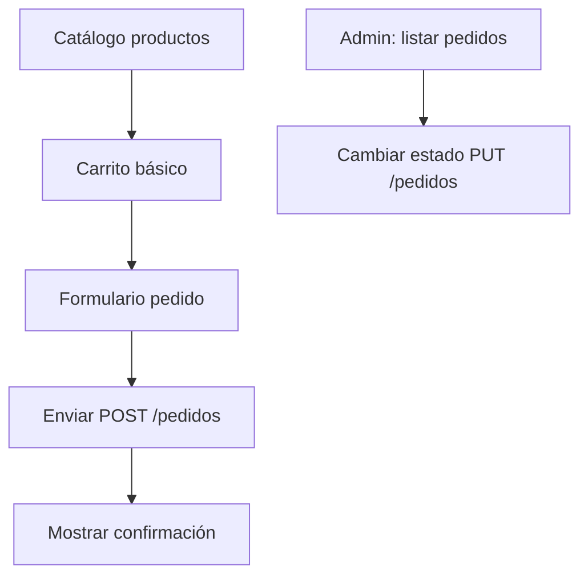

# 🎓 GUÍA DEFINITIVA: CÓMO CREAR CUALQUIER ENDPOINT
## 📚 PASO 1: ENTENDER QUÉ NECESITAS
    -Hazte estas preguntas:
-¿Qué acción hago? (crear, leer, actualizar, borrar, acción especial)
-¿Afecta a UN recurso o VARIOS? (un producto vs todos los productos)
-¿Necesito datos del cliente? (body con JSON)
-¿Hay lógica de negocio compleja? (validaciones, cálculos)

### 🔍 ANÁLISIS DE TU CASO: AUMENTAR STOCK
    -Respuestas:
-Acción: Actualizar stock (acción especial, no es un UPDATE completo)
-Afecta a: UN producto específico (necesito el ID)
-Necesito datos: Sí, la cantidad a aumentar (body con {"cantidad": 50})
-Lógica compleja: Sí, validar que cantidad > 0, que producto existe, etc.

## 🛠️ PASO 2: DECIDIR CAPAS
### REGLA DE ORO:
-Lógica simple (solo CRUD básico) → Controlador llama Repository directamente
-Lógica compleja (validaciones, cálculos, afecta múltiples tablas) → Controlador llama Service
-Tu caso (aumentar stock):
-✅ Necesitas validar cantidad > 0
-✅ Necesitas validar que producto existe
-✅ Necesitas validar que no pones stock negativo
-✅ Ya tienes ProductoService.aumentarStock() con estas validaciones
-DECISIÓN: Controlador → Service (NO repository directo)

### 🎯 DIAGRAMA MENTAL: FLUJO CORRECTO
Cliente Frontend
    ↓
POST /productos/5/stock/aumentar
Body: {"cantidad": 50}
    ↓
ProductoController.aumentarStock()
    → Log: "Aumentando 50 unidades"
    → Llama productoService.aumentarStock(5, 50)
        ↓
    ProductoService.aumentarStock(5, 50)
        → Busca producto ID=5 en BD
        → ¿Existe? SI → continúa / NO → lanza excepción "Producto no encontrado"
        → ¿Cantidad > 0? SI → continúa / NO → lanza excepción "Cantidad debe ser > 0"
        → producto.setStock(stock + 50)
        → Guarda en BD
        → Log: "Stock aumentado en 50. Nuevo stock: 100"
        ↓
    Controlador recupera producto actualizado
    Controlador devuelve JSON del producto
    ↓
Cliente recibe respuesta 200 OK con producto actualizado

### 📋 RESUMEN DE LA LÓGICA (GRÁBATE ESTO):
Cuándo usar Repository directo:
✅ Leer datos (GET) sin lógica
✅ Crear entidad simple (POST) sin validaciones especiales
✅ Borrar simple (DELETE) sin efectos secundarios
Cuándo usar Service:
✅ Validaciones (cantidad > 0, stock suficiente, etc.)
✅ Cálculos (totales, precios, etc.)
✅ Afecta múltiples tablas (crear pedido + líneas + reducir stock)
✅ Logs informativos detallados
✅ Lógica de negocio (reglas del panadero, permisos, etc.)

## 🎓 FÓRMULA PARA CREAR CUALQUIER ENDPOINT:
1. ¿Qué hace? (aumentar stock)
2. ¿Afecta a uno o varios? (uno, necesito ID)
3. ¿Necesito datos? (sí, cantidad)
4. ¿Hay validaciones? (sí, cantidad > 0, producto existe)
   → SI hay validaciones → USA SERVICE
   → NO hay validaciones → USA REPOSITORY
5. Escribe el método:
   - Log entrada
   - Llama service/repository
   - Devuelve respuesta HTTP
  
## 🎯 PASO 3: PATRÓN GENERAL PARA CUALQUIER ENDPOINT
@[HttpMethod]("[/ruta]")  // GET, POST, PUT, DELETE, PATCH
public ResponseEntity<TipoRetorno> nombreMetodo(
    @PathVariable (si necesitas ID) Long id,
    @RequestBody (si necesitas datos) DtoClase dto) {
    
    // 1️⃣ LOG DE ENTRADA
    log.info("[METHOD /ruta] Haciendo acción X");
    
    // 2️⃣ VALIDACIONES BÁSICAS (si no las haces en Service)
    if (dto == null) {
        throw new ResponseStatusException(HttpStatus.BAD_REQUEST, "Payload obligatorio");
    }
    
    // 3️⃣ LÓGICA DE NEGOCIO
    if (es_logica_simple) {
        // Llama repository directo
        Entidad resultado = repository.save(...);
    } else {
        // Llama service
        Entidad resultado = service.metodoDelService(...);
    }
    
    // 4️⃣ LOG DE SALIDA (opcional)
    log.info("[METHOD /ruta] Acción completada");
    
    // 5️⃣ RESPUESTA HTTP
    return ResponseEntity.status(CodigoHTTP).body(resultado);
}

# Respostas
- 200 OK - Operación exitosa con datos
- 201 Created - Recurso creado exitosamente
- 204 No Content - Éxito pero sin datos
- 400 Bad Request - Datos inválidos
- 401 Unauthorized - No autenticado
- 403 Forbidden - Sin permisos
- 404 Not Found - Recurso no existe
- 409 Conflict - Conflicto de datos
- 500 Internal Error - Error del servidor

###  ÉXITO
- return ResponseEntity.ok(datos);                    // 200
- return ResponseEntity.status(201).body(datos);      // 201  
- return ResponseEntity.noContent().build();          // 204

### ERROR
- return ResponseEntity.badRequest().body(mensaje);   // 400
- return ResponseEntity.notFound().build();           // 404
- return ResponseEntity.status(403).build();          // 403
- return ResponseEntity.internalServerError().build(); // 500

# 🎯 SIGUIENTE FASE: FRONTEND

## Flujo de Usuario

**Diagrama de flujo del frontend**: Ilustra el recorrido del usuario desde que consulta el catálogo hasta que confirma el pedido, incluyendo la gestión del carrito temporal y el panel de administración.

## Páginas a Desarrollar
- **index.html**: Catálogo de productos (GET /productos)
- **carrito.html**: Carrito con LocalStorage
- **pedido.html**: Formulario cliente + resumen (POST /pedidos)
- **admin.html**: Listar y gestionar pedidos (GET /pedidos, PUT /pedidos/{id})

## Stack Frontend
- HTML5 + CSS3 (responsive)
- JavaScript vanilla (fetch API)
- LocalStorage para carrito temporal

---

# ✅ BACKEND COMPLETADO (31/10/2025)

### Checklist backend 100% ready:
-Arquitectura backend sólida:
✅ Spring Boot 3.5.7 + Java 21
✅ MySQL con JPA/Hibernate
✅ Estructura en capas (Controller → Service → Repository)
✅ Validaciones en DTO y Entity
✅ Transacciones con rollback automático
✅ Logging completo en consola
-Funcionalidades implementadas:
✅ CRUD completo de Clientes, Productos y Pedidos
✅ Gestión de stock con reducción automática al crear pedidos
✅ Endpoint para aumentar stock manualmente
✅ Cálculo automático de totales con lifecycle hooks
✅ Relaciones complejas (Pedido → LineaPedido → Producto)
✅ Prevención de recursión infinita en JSON
✅ Precisión decimal exacta con BigDecimal (fix del bug de 3.59999...)
-Bugs resueltos durante el testing:
✅ Recursión infinita en JSON (añadido @JsonIgnore)
✅ Precisión decimal incorrecta (migrado de Double a BigDecimal)
✅ Import sin usar en PedidoController
------------------------------------------------------------
Endpoint	Método	Estado	Verificado
/clientes	POST	✅ OK	Crea clientes
/clientes	GET	✅ OK	Lista todos
/clientes/{id}	GET	✅ OK	Detalle cliente
/clientes/{id}	PUT	✅ OK	Actualiza datos
/productos	POST	✅ OK	Crea productos
/productos	GET	✅ OK	Lista todos
/productos/{id}	PUT	✅ OK	Actualiza nombre/precio/descripción
/productos/{id}/AumStock	POST	✅ OK	Aumenta stock
/pedidos	POST	✅ OK	Crea pedido + líneas + reduce stock
/pedidos	GET	✅ OK	Lista todos con líneas
/pedidos/cliente/{id}	GET	✅ OK	Pedidos de un cliente

---

# 📊 RESUMEN DE PROGRESO

| Fase | Estado | Tiempo invertido |
|------|--------|------------------|
| Backend API REST | ✅ 100% | ~2-3 semanas |
| Testing manual | ✅ 100% | ~2 días |
| Documentación técnica | ✅ 100% | ~1 día |
| Frontend HTML/CSS/JS | ⏳ Pendiente | ~3-5 días |
| Despliegue | ⏳ Pendiente | ~1 día |

**Líneas de código Java**: ~1500+  
**Endpoints funcionales**: 15+  
**Bugs críticos resueltos**: 2 (recursión JSON, precisión decimal)