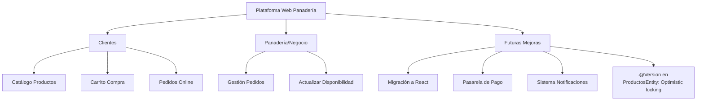
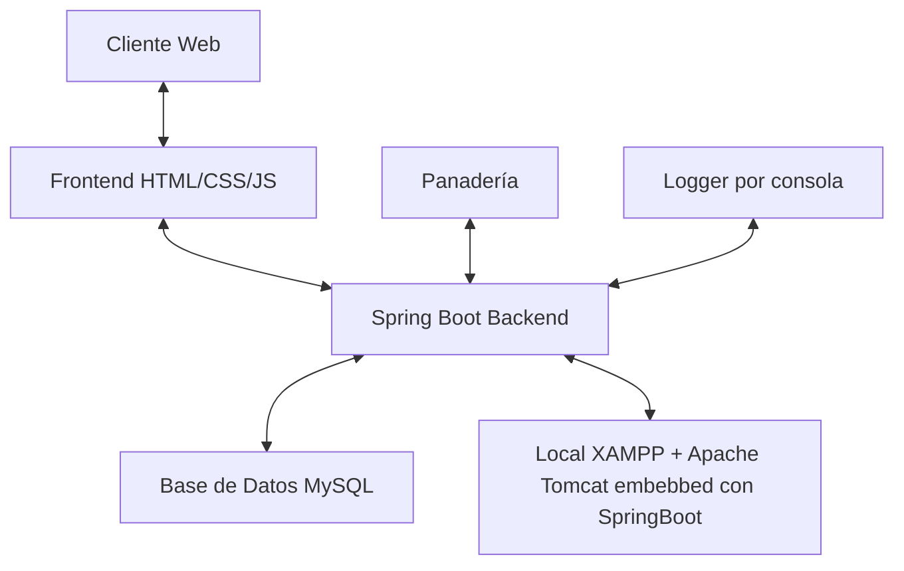
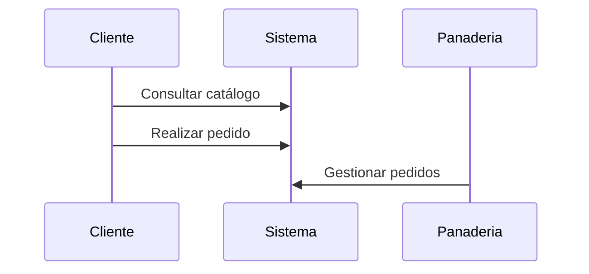

##### Enlace a documentación: [doc](doc/doc.md)
##### Enlace repo GitLab: [RepoGitLab](https://gitlab.iessanclemente.net/dawd/a22adrianfh)
# Plataforma web de pedidos para panadería

## Descripción

Este proyecto consiste en el desarrollo de una **aplicación web para la gestión de pedidos en una panadería aplicable también con pequeñas modificaciones a pequeños negocios en general que se quieran digitalizar**.

La idea principal es ofrecer a los clientes la posibilidad de consultar el catálogo de productos disponibles (panes, bollería y repostería), realizar pedidos online y permitir a la panadería gestionar dichos pedidos.

El objetivo es digitalizar empresas pequeñas en este caso en el sector panadero, simplificando tanto la experiencia de compra del cliente como los pedidos por parte del negocio, con posibilidad de ser ampliado en el futuro con más funcionalidades (como notificaciones, pasarela de pago). También me gustaría migrar el front a React cuando controle un poco más de la librería y tenga algo más de tiempo ya que con la FCT en Santiago y lo poco que dura la FCT + PFC no dispongo de mucho espacio de tiempo para hacer un proyecto como el que me gustaría desarrollar y el cual seguiré trabajándolo cuando finalice el ciclo.

**Diagrama de arquitectura general**: Muestra los actores principales (Clientes y Panadería), las funcionalidades disponibles para cada uno, y las mejoras futuras planificadas.



## Estado del Proyecto

✅ **BACKEND COMPLETADO**
- API REST funcional con 15+ endpoints
- Gestión completa de Clientes, Productos y Pedidos
- Sistema de stock automático con transacciones
- Validaciones en múltiples capas
- Precisión decimal exacta con BigDecimal

⏳ **FRONTEND EN DESARROLLO**
- Pendiente: Catálogo de productos, carrito y formulario de pedido

## Instalación / Puesta en marcha

En la versión definitiva en producción se utilizaría un servidor (Por ejemplo Apache, al tener SpringBoot un propio apache dentro de cada proyecto funcionaría muy bien), en esta primera versión usaré XAMPP + phpmyadmin para el MySQL con el objetivo de llegar a tiempo a presentación del PFC.

**Diagrama de componentes técnicos**: Representa la arquitectura técnica del sistema con las tecnologías utilizadas (Spring Boot, MySQL, XAMPP) y la comunicación entre capas.



1. **Clonar el repositorio**: clonar desde gitlab

2. **Acceder al directorio del proyecto y levantar el backend**: abrirlo en vscode y darle al run en el main de springBoot o `./mvnw spring-boot:run`

3. **Instalar XAMPP**, en phpMyAdmin crear base de datos `panaderiaPFC`:
   - Abrir XAMPP Control Panel → Start MySQL
   - Ir a `http://localhost/phpmyadmin`
   - Nueva base de datos: `panaderiaPFC` (cotejamiento: `utf8mb4_unicode_ci`)

4. **Configurar application.properties** (ya configurado con valores por defecto):
```properties
spring.datasource.url=jdbc:mysql://localhost:3306/panaderiaPFC?useSSL=false&serverTimezone=UTC
spring.datasource.username=root
spring.datasource.password=
spring.jpa.hibernate.ddl-auto=update
spring.jpa.show-sql=true
```

5. **Levantar el backend**:
```bash
cd PFC/pfcdaw
./mvnw spring-boot:run
```
O desde VSCode: Run → Start Debugging (F5) en `PfcdawApplication.java`

El backend arrancará en `http://localhost:8080`

6. **Cargar datos de prueba** (opcional):
   - Abrir phpMyAdmin → Base de datos `panaderiaPFC` → pestaña SQL
   - Copiar y pegar contenido de `src/main/resources/data-sample.sql`
   - Click **Continuar**
   - Esto creará 3 clientes y 4 productos de ejemplo

7. **Probar la API** con Thunder Client (VSCode) o Postman:
```http
GET http://localhost:8080/productos
GET http://localhost:8080/clientes
POST http://localhost:8080/pedidos
```

8. **Frontend**: VSCode + LiveServer (próximamente)

## Uso

Se trata de una aplicación sencilla para cumplir los tiempos de entrega, enfatizar en que seguiré trabajando en la app y que aplicaré distintas funcionalidades y mejoras.

**Los clientes podrán:**
- Navegar por el catálogo de productos
- Añadir productos al carrito
- Realizar un pedido

**La panadería podrá:**
- Gestionar pedidos recibidos
- Actualizar disponibilidad de productos

**Diagrama de interacciones básicas**: Representa los casos de uso principales del sistema desde la perspectiva de los actores.


## Sobre el autor

Soy Adrián Fábregas, estudiante de DAW, tengo un FP superior de Ed. Infantil pero la mayoría de mi vida laboral está relacionada con ir al mar y vivir gracias a él y sus recursos, siempre respetándolo. En la parte de programación la conocí en 2022 cuando un amigo cercano vio la situación que atravesamos en las rías gallegas sobre todo en la de Noia que es donde yo trabajo y que cada año está más débil en todos los sentidos, me aconsejó meterme en este mundo y de 2022 compaginándolo con mi trabajo comencé a aprender y a entender este mundillo. Me causó mucho interés java y luego más adelante empecé a aprender Spring Boot el verano antes de la FCT y el PFC, me gustaría desarrollar mi carrera de programador en ese ámbito aunque estoy abierto a todo, por ejemplo estoy aprendiendo React para la parte del front además de seguir aprendiendo Spring Boot que aún no llevo mucho tiempo con él.

Me decanté por este proyecto porque permite aplicar de forma práctica los conocimientos adquiridos en el ciclo, y además responde a una necesidad real de modernización en los pequeños negocios y aunque no dispongo de mucho tiempo debido a la FCT, que vivo en Noia y la tengo en Santiago ya pierdo 10h más o menos todos los días además de llegar a casa algo cansado, además tengo 31 años y tengo bastantes responsabilidades personales que también requieren algo de tiempo, por tanto en esta primera versión inicial será algo más sencilla para cumplir con el PFC y aprobar el ciclo y luego seguir trabajándola y mejorándola en todos los sentidos, desde el back hasta el front migrándolo a React, la gestión de errores, distintas mejoras en la app...

**Contacto**: adriannoia104@gmail.com

## Licencia

Este proyecto está licenciado bajo la [MIT License](LICENSE).

Usaré MIT por la libertad total que tiene a la hora del uso o de la modificación del código y documentación, siendo flexible a la hora de trabajar con open source. Además es de fácil de entender y fomenta la innovación.

## Documentación

Este proyecto dispone de [documentación extendida](doc/doc.md) con detalles técnicos y diseño.

## Guía de contribución

Las contribuciones son bienvenidas en forma de:
- Nuevas funcionalidades (ej.: notificaciones, mejora del carrito, mejora del FrontEnd migrándolo a React...)
- Corrección de errores
- Mejora del código o de la documentación

Para colaborar:
1. Haz un fork del repositorio
2. Crea una rama con tu mejora
3. Envía un pull request

