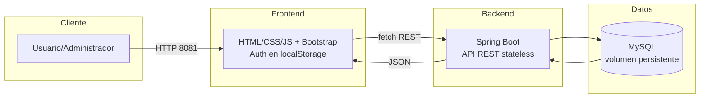
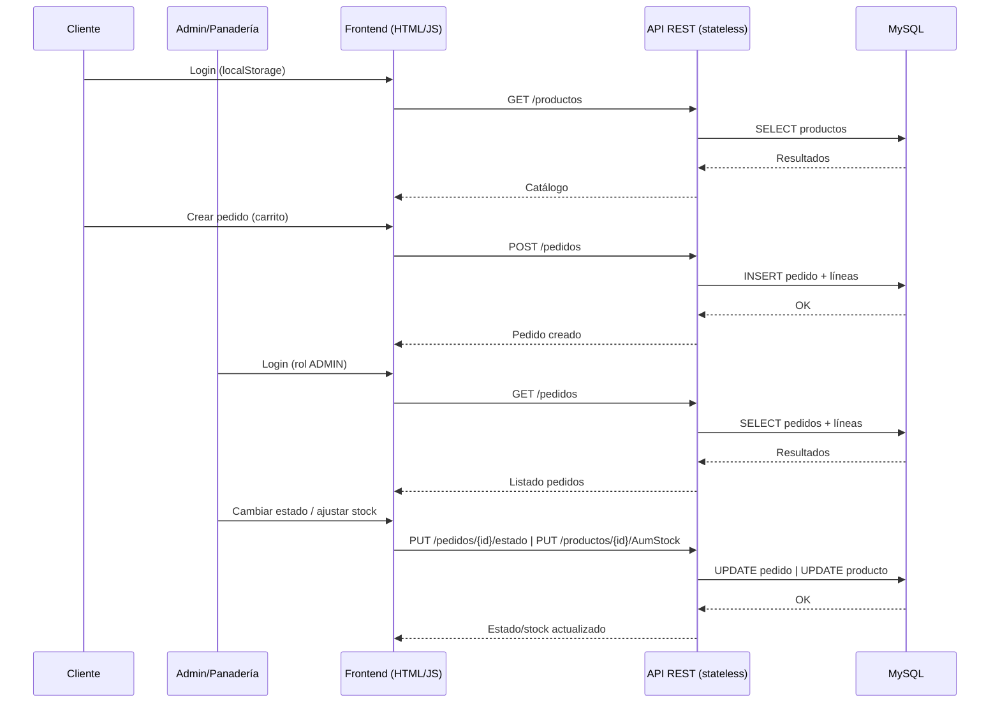

##### Enlace a documentación: [doc](./doc/doc.md)
##### Enlace repo GitLab: [RepoGitLab](https://gitlab.iessanclemente.net/dawd/a22adrianfh)

# Plataforma web de pedidos para panadería

## 🔗 Enlaces de Acceso y Credenciales

**Acceso a la aplicación (con Docker):**
- 🌐 **Frontend**: [http://localhost:8081](http://localhost:8081)
- 📚 **Swagger UI (API Docs)**: [http://localhost:8081/swagger-ui/index.html](http://localhost:8081/swagger-ui/index.html)
- 💻 **Código GitLab**: [https://gitlab.iessanclemente.net/dawd/a22adrianfh/-/tree/main/PFC/pfcdaw](https://gitlab.iessanclemente.net/dawd/a22adrianfh/-/tree/main/PFC/pfcdaw)
- 🧪 **Pruebas y Testing**: Ver sección [Codificación y Pruebas](#codificación-y-pruebas)

**Credenciales de prueba:**
| Rol   | Email                      | Contraseña |
|-------|----------------------------|------------|
| ADMIN | admin@panaderia.com        | admin123   |
| USER  | juan.perez@example.com     | user123    |

---

## Índice

- [Plataforma web de pedidos para panadería](#plataforma-web-de-pedidos-para-panadería)
  - [🔗 Enlaces de Acceso y Credenciales](#-enlaces-de-acceso-y-credenciales)
  - [Índice](#índice)
  - [Requisitos previos](#requisitos-previos)
  - [Descripción](#descripción)
  - [Instalación / Puesta en marcha](#instalación--puesta-en-marcha)
    - [Opción recomendada: Despliegue con Docker](#opción-recomendada-despliegue-con-docker)
    - [Opción alternativa: XAMPP/MySQL local](#opción-alternativa-xamppmysql-local)
  - [FAQ - Preguntas frecuentes](#faq---preguntas-frecuentes)
  - [Manual de Usuario](#manual-de-usuario)
    - [👤 Para Clientes (Usuarios)](#-para-clientes-usuarios)
    - [⚙️ Para Administradores](#️-para-administradores)
  - [Codificación y Pruebas](#codificación-y-pruebas)
  - [Uso](#uso)
  - [Sobre el autor](#sobre-el-autor)
  - [Licencia](#licencia)
  - [Documentación](#documentación)
  - [Guía de contribución](#guía-de-contribución)

## Requisitos previos

| Herramienta         | Versión recomendada | ¿Para qué?                |
|---------------------|---------------------|---------------------------|
| Docker              | 20.10+              | Despliegue recomendado    |
| Docker Compose      | 1.29+ (o integrado) | Orquestar servicios       |
| Java (JDK)          | 21+                 | Solo si usas modo local   |
| XAMPP/MySQL         | 8+                  | Solo si usas modo local   |
| VSCode/IDE          | -                   | Edición de código         |

## Descripción

Este proyecto consiste en el desarrollo de una **aplicación web para la gestión de pedidos en una panadería aplicable también con pequeñas modificaciones a pequeños negocios en general que se quieran digitalizar**.

La idea principal es que el cliente(user) pueda logearse/registrarse, realizar pedidos online, consultar las fotos de productos disponibles y permitir a la panadería(admin) gestionar dichos pedidos, clientes o productos

El objetivo es digitalizar empresas pequeñas en este caso en el sector panadero o cualquier negocio pequeño, simplificando tanto la experiencia de compra del cliente como los pedidos por parte del negocio, con posibilidad de ser ampliado en el futuro con más funcionalidades (como notificaciones, pasarela de pago...). También me gustaría migrar el front a React cuando controle un poco más de la librería y tenga algo más de tiempo ya que con la FCT en Santiago y lo poco que dura la FCT + PFC no dispongo de mucho espacio de tiempo para hacer un proyecto como el que me gustaría desarrollar y el cual seguiré trabajándolo cuando finalice el ciclo.

**Estado y seguridad actuales**: API REST sin sesiones de servidor (stateless); el “login” se guarda en el cliente en `localStorage` y el backend no valida autenticación/roles. Planificado migrar a Spring Security con sesiones / JWT (ver [doc/doc.md](doc/doc.md) sección 6.1).

**Diagrama de arquitectura general (actual)**: Frontend estático (HTML/JS/Bootstrap) servido por Nginx, API REST en Spring Boot, MySQL persistente. Login/rol se guarda en `localStorage` (pendiente migrar a Spring Security/JWT), tráfico expuesto por Nginx en `8081`.

```mermaid
graph LR
  subgraph Cliente
    U[Usuario/Administrador]
  end

  subgraph Frontend
    F[HTML/CSS/JS + Bootstrap
    Auth en localStorage]
  end

  subgraph Backend
    B[Spring Boot
    API REST stateless]
  end

  subgraph Datos
    D[(MySQL
    volumen persistente)]
  end

  U -->|HTTP 8081| F
  F -->|fetch REST| B
  B --> D
  D --> B
  B -->|JSON| F
```

## Instalación / Puesta en marcha

> Guía completa en [./doc/doc.md](doc/doc.md) → secciones "Despliegue recomendado: Docker Compose" y "Localhost: XAMPP/MySQL local".

### Opción recomendada: Despliegue con Docker
1. `cd a la carpeta donde este el docker-compose: PFC/pfcdaw`
2. `docker compose up` (o `docker-compose up --build` para recompilar)
3. Accede a frontend y el Swagger en `http://localhost:8081/` y `/swagger-ui/index.html`

### Opción alternativa: XAMPP/MySQL local
1. Crea la base `panaderiaPFC` en phpMyAdmin (XAMPP → MySQL).
2. Ajusta `application.properties` si cambias usuario/clave.
3. Arranca el backend con `./mvnw spring-boot:run` (frontend con LiveServer). Pasos detallados en [doc/doc.md#localhost-xamppmysql-local](doc/doc.md#localhost-xamppmysql-local).

## FAQ - Preguntas frecuentes

Resolución de problemas centralizada en [Problemas comunes y soluciones](./doc/doc.md#problemas-comunes-y-soluciones) (puertos, volúmenes, cambio de puertos, uso sin Docker, backups de la BD).

---

## Manual de Usuario

### 👤 Para Clientes (Usuarios)

**1. Registrarse en la aplicación:**
- Accede a [http://localhost:8081](http://localhost:8081)
- Haz clic en el botón **"Registrarse"**
- Rellena el formulario con tus datos (nombre, email, contraseña, dirección, empresa, teléfono)
- Pulsa **"Crear Cuenta"**
- Inicia sesión con tu email y contraseña

**2. Realizar un pedido:**
- Una vez dentro, verás el catálogo de productos disponibles
- Selecciona la cantidad de cada producto que desees
- Haz clic en **"Añadir al carrito"**
- Revisa tu carrito y pulsa **"Realizar Pedido"**
- Confirma tu pedido

**3. Ver mis pedidos:**
- En la página principal, verás todos tus pedidos realizados
- Puedes ver el estado de cada pedido (PENDIENTE, EN_PREPARACION, LISTO, ENTREGADO)
- Haz clic en el botón 👁️ para ver los detalles de cada pedido

**4. Cerrar sesión:**
- Haz clic en tu nombre de usuario en la esquina superior derecha
- Selecciona **"Cerrar Sesión"**

---

### ⚙️ Para Administradores

**1. Acceso al panel de administración:**
- Inicia sesión con credenciales de admin: `admin@panaderia.com` / `admin123`
- Serás redirigido automáticamente al **Dashboard**

**2. Gestionar Productos:**
- Ve a la pestaña **"Productos"**
- **Crear producto**: Pulsa el botón ➕, rellena el formulario (nombre, descripción, precio, stock, imagen) y guarda
- **Editar producto**: Pulsa el botón ✏️, modifica los datos y guarda
- **Gestionar stock**: Pulsa el botón 📦, añade o reduce stock según necesites
- **Editar foto**: Pulsa el botón 🖼️, selecciona nueva imagen y guarda
- **Eliminar producto**: Pulsa el botón 🗑️ y confirma

**3. Gestionar Clientes:**
- Ve a la pestaña **"Clientes"**
- **Crear cliente**: Pulsa ➕ y rellena el formulario
- **Editar cliente**: Pulsa ✏️ para modificar datos
- **Eliminar cliente**: Pulsa 🗑️ y confirma

**4. Gestionar Pedidos:**
- Ve a la pestaña **"Pedidos"**
- Verás todos los pedidos con su estado actual
- **Ver detalles**: Pulsa 👁️ para ver productos del pedido
- **Cambiar estado**: Dentro del modal de detalles, selecciona el nuevo estado y pulsa **"Actualizar Estado"**
- Estados disponibles: PENDIENTE → EN_PREPARACION → LISTO → ENTREGADO (o CANCELADO)

**5. Exportar datos:**
- En cada tabla, usa los botones superiores para exportar:
  - 📋 Copiar
  - 📄 CSV
  - 📊 Excel
  - 📕 PDF
  - 🖨️ Imprimir

**6. Buscar y ordenar:**
- Usa la barra de búsqueda para filtrar datos
- Haz clic en los encabezados de columna para ordenar

---

## Codificación y Pruebas

**Estructura del código en GitLab:**
- 📂 Backend (Spring Boot): [PFC/pfcdaw/src/main/java](https://gitlab.iessanclemente.net/dawd/a22adrianfh/-/tree/main/PFC/pfcdaw/src/main/java/com/pfcdaw/pfcdaw)
- 📂 Frontend (HTML/CSS/JS): [PFC/pfcdaw/src/main/resources/static](https://gitlab.iessanclemente.net/dawd/a22adrianfh/-/tree/main/PFC/pfcdaw/src/main/resources/static)
- 📂 Configuración Docker: [PFC/pfcdaw](https://gitlab.iessanclemente.net/dawd/a22adrianfh/-/tree/main/PFC/pfcdaw)

**Pruebas rápidas:**
- Swagger UI: [http://localhost:8081/swagger-ui/index.html](http://localhost:8081/swagger-ui/index.html)
- Flujos mínimos: registrar usuario → crear pedido → revisar pedido; admin → crear producto → actualizar stock → cambiar estado pedido.
- Validaciones y decisiones técnicas detalladas en [./doc/doc.md](./doc/doc.md) (secciones 4 y 5).

---

## Uso
Se trata de una aplicación sencilla para cumplir los tiempos de entrega, enfatizar en que seguiré trabajando en la app y que aplicaré distintas funcionalidades y mejoras.

**Los clientes podrán:**
- Añadir productos al carrito
- Realizar un pedido
- Visualizar fotos de los productos

**La panadería podrá:**
- Gestionar pedidos recibidos
- Gestionar productos/pedidos/clientes 

**Diagrama de interacciones básicas**: Representa los casos de uso principales del sistema desde la perspectiva de los actores, es decir como se gestiona cada "rol" y sus funcionalizades.

```mermaid
sequenceDiagram
  participant Cliente
  participant Admin as Admin/Panadería
  participant Frontend as Frontend (HTML/JS)
  participant Backend as API REST (stateless)
  participant DB as MySQL

  Cliente->>Frontend: Login (localStorage)
  Frontend->>Backend: GET /productos
  Backend->>DB: SELECT productos
  DB-->>Backend: Resultados
  Backend-->>Frontend: Catálogo
  Cliente->>Frontend: Crear pedido (carrito)
  Frontend->>Backend: POST /pedidos
  Backend->>DB: INSERT pedido + líneas
  DB-->>Backend: OK
  Backend-->>Frontend: Pedido creado

  Admin->>Frontend: Login (rol ADMIN)
  Frontend->>Backend: GET /pedidos
  Backend->>DB: SELECT pedidos + líneas
  DB-->>Backend: Resultados
  Backend-->>Frontend: Listado pedidos
  Admin->>Frontend: Cambiar estado / ajustar stock
  Frontend->>Backend: PUT /pedidos/{id}/estado | PUT /productos/{id}/AumStock
  Backend->>DB: UPDATE pedido | UPDATE producto
  DB-->>Backend: OK
  Backend-->>Frontend: Estado/stock actualizado
```
## Sobre el autor

Soy Adrián Fábregas, estudiante de DAW, tengo un FP superior de Ed. Infantil pero la mayoría de mi vida laboral está relacionada con ir al mar y vivir gracias a él y sus recursos, siempre respetándolo. En la parte de programación la conocí en 2022 cuando un amigo cercano vio la situación que atravesamos en las rías gallegas sobre todo en la de Noia que es donde yo trabajo y que cada año está más débil en todos los sentidos, me aconsejó meterme en este mundo y de 2022 compaginándolo con mi trabajo comencé a aprender y a entender este mundillo. Me causó mucho interés java y luego más adelante empecé a aprender Spring Boot el verano antes de la FCT y el PFC, me gustaría desarrollar mi carrera de programador en ese ámbito aunque estoy abierto a todo, por ejemplo estoy aprendiendo React para la parte del front además de seguir aprendiendo Spring Boot que aún no llevo mucho tiempo con él.

Me decanté por este proyecto porque permite aplicar de forma práctica los conocimientos adquiridos en el ciclo, y además responde a una necesidad real de modernización en los pequeños negocios y aunque no dispongo de mucho tiempo debido a la FCT, que vivo en Noia y la tengo en Santiago ya pierdo 10h más o menos todos los días además de llegar a casa algo cansado, además tengo 31 años y tengo bastantes responsabilidades personales que también requieren algo de tiempo, por tanto en esta primera versión inicial será algo más sencilla para cumplir con el PFC y aprobar el ciclo y luego seguir trabajándola y mejorándola en todos los sentidos, desde el back hasta el front migrándolo a React, la gestión de errores, distintas mejoras en la app...

**Contacto**: adriannoia104@gmail.com

## Licencia

Este proyecto está licenciado bajo la [MIT License](LICENSE).

Usaré MIT por la libertad total que tiene a la hora del uso o de la modificación del código y documentación, siendo flexible a la hora de trabajar con open source. Además es de fácil de entender y fomenta la innovación.

## Documentación

Este proyecto dispone de [documentación extendida](./doc/doc.md) con detalles técnicos y diseño.

## Guía de contribución

Las contribuciones son bienvenidas en forma de:
- Nuevas funcionalidades (ej.: notificaciones, mejora del carrito...)
- Corrección de errores
- Mejora del código o de la documentación

Para colaborar:
1. Haz un fork del repositorio
2. Crea una rama con tu mejora
3. Envía un pull request

