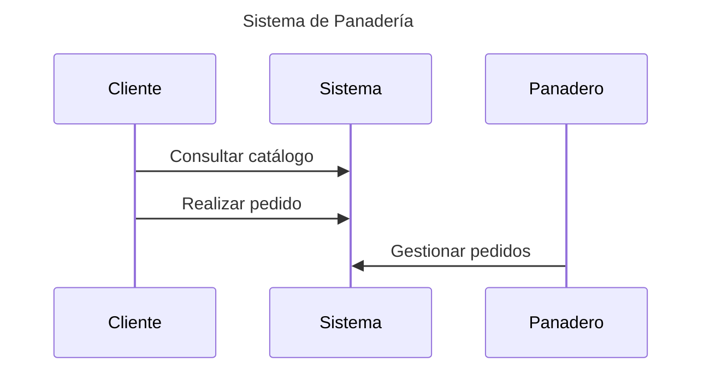
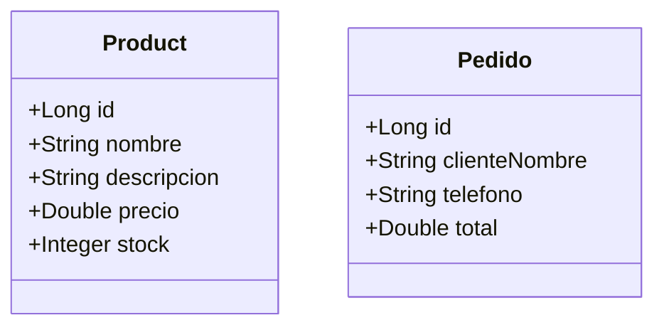
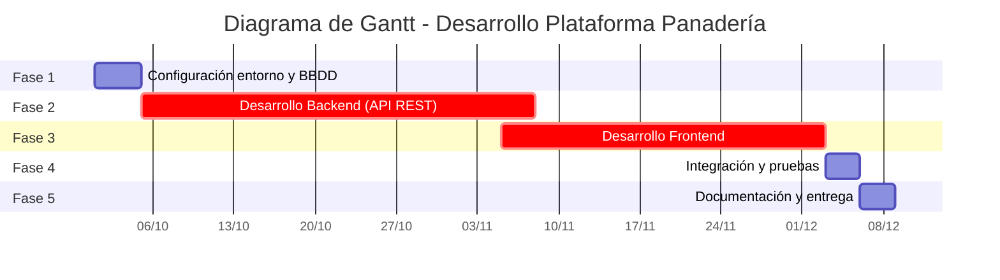

# Plataforma web de pedidos para panadería
### [RepoGitHub](https://github.com/CacholoDev/PFC)
### [RepoGitLab](https://gitlab.iessanclemente.net/dawd/a22adrianfh)
### TODO abaixo de todo

- [Plataforma web de pedidos para panadería](#plataforma-web-de-pedidos-para-panadería)
    - [RepoGitHub](#repogithub)
    - [RepoGitLab](#repogitlab)
    - [TODO abaixo de todo](#todo-abaixo-de-todo)
  - [Introducción](#introducción)
  - [Estado de arte o análisis del contexto](#estado-de-arte-o-análisis-del-contexto)
  - [Propósito](#propósito)
  - [Objetivos](#objetivos)
  - [Alcance](#alcance)
    - [Funcionalidades incluidas:](#funcionalidades-incluidas)
    - [Límites: debido al tiempo que tengo para realizar el PFC](#límites-debido-al-tiempo-que-tengo-para-realizar-el-pfc)
    - [Contexto de uso:](#contexto-de-uso)
  - [Conclusiones](#conclusiones)
  - [Referencias, Fuentes consultadas y Recursos externos: Webgrafía](#referencias-fuentes-consultadas-y-recursos-externos-webgrafía)
        - [fin 1ª entrega(PFC)](#fin-1ª-entregapfc)
- [TODO](#todo)
  - [1.Análisis](#1análisis)
      - [-Diagrama de caso de uso](#-diagrama-de-caso-de-uso)
  - [2. Diseño](#2-diseño)
    - [Arquitectura general](#arquitectura-general)
    - [Estructura básica del backend](#estructura-básica-del-backend)
      - [Decisiones de diseño](#decisiones-de-diseño)
      - [Uso EndPoints](#uso-endpoints)
  - [3.Planificación](#3planificación)
    - [Fases del proyecto](#fases-del-proyecto)
    - [Diagrama de Gantt](#diagrama-de-gantt)
    - [Estimación de recursos y costes](#estimación-de-recursos-y-costes)
    - [Conclusión](#conclusión)
        - [fin 2º entrega(PFC)](#fin-2º-entregapfc)

## Introducción

El presente proyecto tiene como finalidad el diseño y desarrollo de una aplicación web orientada a la gestión de pedidos en una panadería. La motivación surge de la necesidad de digitalizar procesos tradicionales en pequeños comercios, permitiendo que clientes y negocio interactúen de una forma más eficiente y moderna.

El sistema constará de un **backend desarrollado con Spring Boot** y persistencia en **MySQL**, junto con un **frontend sencillo en HTML, CSS y JavaScript**. Se busca crear un **prototipo funcional** que facilite el registro de productos, la consulta de catálogo y la realización de pedidos, constituyendo una base sólida que podría evolucionar en el futuro hacia un sistema más completo.

## Estado de arte o análisis del contexto

En la actualidad, la digitalización en pequeños negocios de alimentación sigue siendo desigual. Mientras que grandes cadenas cuentan con aplicaciones móviles o webs personalizadas, muchas panaderías y negocios locales continúan gestionando pedidos únicamente de manera presencial o telefónica.

La aplicación se orienta principalmente a:

- **Clientes** habituales que buscan comodidad y rapidez al realizar sus pedidos.
- **Propietarios de panaderías** que necesitan un método simple para organizar encargos sin recurrir a herramientas complejas o costosas.

Existen soluciones en el mercado como aplicaciones de delivery (Glovo, Uber Eats), pero resultan demasiado generales o implican costes elevados para pequeños comercios. Nuestro enfoque propone una solución ligera, adaptable y pensada **específicamente para un negocio pequeño**, sin dependencias externas.

El desarrollo abre una oportunidad de modernización para estos negocios, con un prototipo que podría evolucionar hacia una solución más robusta e incluso comercializable.

## Propósito

El propósito de este proyecto es **crear una aplicación web que facilite la gestión de pedidos en una panadería**, permitiendo a los clientes visualizar un catálogo online y realizar pedidos, y al admin gestionar dichos pedidos de forma sencilla.

El objetivo principal es la **digitalización de la panader´ia**, con una solución ligera, práctica y de fácil implementación.

## Objetivos

- Desarrollar un **backend en Spring Boot** con una API REST que gestione productos y pedidos.
- Implementar la **persistencia de datos en MySQL**.
- Diseñar un **frontend sencillo con HTML, CSS y JavaScript**, que permita al cliente navegar por el catálogo y realizar pedidos.
- Crear una interfaz básica para la **gestión de pedidos por parte del negocio**.
- Documentar el proyecto en GitLab/GitHub con instrucciones claras de instalación y uso.
- Desplegar un prototipo funcional que pueda ser probado en entorno local.

## Alcance

### Funcionalidades incluidas:

- Visualización del catálogo de productos.
- Carrito básico
- Realización de pedidos.
- Gestión interna de pedidos recibidos.
- En principio la haré sin roles pero si me da tiempo a llegar al PFC haré admin / user, si no será futura implementación.
- Persistencia en base de datos MySQL.

### Límites: debido al tiempo que tengo para realizar el PFC

- No incluirá pasarela de pago en esta primera versión.
- La autenticación será básica.
- El carrito sera básico.
- El frontend será simple (HTML/CSS/JS).
- Se desarrollará como un **prototipo funcional** para entorno local, con futura implementacion de por ejemplo un docker.

### Contexto de uso:

- Proyecto académico de fin de ciclo (DAW).
- Aplicación de ejemplo para un negocio local.
- Base para **futuras ampliaciones** (ej.: mejora del despliegue(implementacion de un Docker), integración de notificaciones,mejora del carrito,mejora del FrontEnd migrandolo a React,Roles de loggin, añadir distintas funcionalidades que pueda pedir el negocio.
- Se desarrollará un prototipo funcional con datos de prueba, no una versión en producción.).  
    

## Conclusiones

Este anteproyecto propone una solución concreta a la falta de digitalización en pequeños comercios, ofreciendo una aplicación sencilla pero funcional que puede servir como prototipo y base para futuras mejoras.

A través de este desarrollo se pondrán en práctica conocimientos de **backend con Java Spring Boot, bases de datos MySQL, y desarrollo frontend básico**, además de aplicar buenas prácticas en documentación y control de versiones con Git.

El proyecto permitirá afianzar competencias clave en desarrollo web y servirá como muestra de aplicación práctica de lo aprendido en el ciclo formativo.

## Referencias, Fuentes consultadas y Recursos externos: Webgrafía

- [Spring Boot Reference Documentation](https://docs.spring.io/spring-boot/docs/current/reference/html/)
- [MySQL Documentation](https://dev.mysql.com/doc/)
- [MDN Web Docs – HTML, CSS y JavaScript](https://developer.mozilla.org/)
- [GitLab Documentation](https://docs.gitlab.com/)
- [StackOverflow](https://stackoverflow.com/)

##### fin 1ª entrega(PFC)

# TODO
## 1.Análisis

Para el desarrollo de este proyecto se ha optado por una **metodología Kanban**, ya que permite organizar las tareas de forma visual y flexible. Dado que se trata de un proyecto individual y con tiempo limitado, además de tener que estar haciendo a la par la FCT en Santiago 8h(09:00-17:00) siendo de Noia y me consume mucho tiempo para hacer un buen PFC.

El enfoque consiste en dividir el trabajo en pequeñas tareas o fases visibles en un tablero (por ejemplo, “Do”, “Doing”, “Done”), lo que ayuda a mantener un control del avance del proyecto de forma sencilla.

Se usa un tablero Trello donde se registran las tareas principales del proyecto:

* Configuración del entorno de desarrollo (Spring Boot, MySQL, VSCode).
* Creación de la base de datos y conexión desde el backend.
* Implementación de la API REST.
* Desarrollo del frontend con HTML, CSS y JavaScript.
* Pruebas locales y documentación.

Trello para ver el Kanban: [KanbanTrello](https://trello.com/b/DpZTdW2t/client-workflow-management) - visibilidad publica.

#### -Diagrama de caso de uso

El siguiente diagrama muestra de forma general las interacciones principales en la aplicación web de pedidos para panadería:

Se refleja las principales funciones del sistema sin entrar aún en detalle de roles avanzados que hare si me da tiempo antes del fin de fecha del PFC, si no lo continuare después de ello, ya que en esta primera versión no se implementan usuarios diferenciados (admin/user), sino que se centra en el flujo básico de pedidos y del funcionamiento de la APIREST con SpringBoot Java.

## 2. Diseño

El proyecto está dividido en dos partes principales:

**Backend**: Desarrollado con Spring Boot, ofrece una API REST para gestionar productos y pedidos, almacenando los datos en MySQL mediante JPA, se podrán ver logs en consola mediante el uso del Logger de SpringBoot.

**Frontend**: Página web sencilla hecha con HTML, CSS y JavaScript, que permite listar productos y realizar pedidos.

### Arquitectura general
[Cliente (HTML/JS)] --> [Spring Boot API REST] --> [Base de datos MySQL]

### Estructura básica del backend

com.panaderia
 ├─ model          (clases Product, Pedido)
 ├─ repository     (interfaces JPA)
 ├─ controller     (endpoints REST, Logger:info de lo que esta pasando por consola)
 └─ PanaderiaApplication.java (Main)

#### Decisiones de diseño
-Uso de de Logger para ver la info de lo que está pasando en la app por consola

- No se implementan roles ni autenticación en esta versión (MVP)

- Los datos de conexión a la base de datos se guardan en un archivo .env (Seguridad adicional)(en este caso los subiremos al github, no pondremos gitignore para mostrar el 100% en el PFC y cuando lo termine, poner el .gitignore con el .env cambiando los datos del user/pass).

- El frontend se comunica con el backend mediante fetch() con peticiones REST

- Es un prototipo funcional para ejecución local

#### Uso EndPoints
*completandoos a medida que os vou facendo no back con SpringBoot:
- **Productos**:

| Método | Endpoint         | Descripción           |
|--------|------------------|-----------------------|
| GET    | /productos       | Listar todos          |
| GET    | /productos/{id}  | Obtener por ID        |
| POST   | /productos       | Crear nuevo producto  |
| PUT    | /productos/{id}  | Actualizar producto   |
| DELETE | /productos/{id}  | Eliminar producto     |

## 3.Planificación

Para la planificación del desarrollo se empleará una **metodología Kanban**, ya que permite una organización visual y flexible del trabajo sin una estructura rígida para gestionar las tareas del proyecto (por ejemplo: desarrollo backend, frontend, pruebas y documentación)..

### Fases del proyecto

1. **Configuración del entorno y base de datos** – 1/2 semana
2. **Desarrollo del backend (API REST y persistencia)** – 4 semanas
3. **Desarrollo del frontend (HTML, CSS, JS)** – 4 semanas
4. **Integración y pruebas locales** – 1/2 semana
5. **Documentación y entrega final** – 1 semana

### Diagrama de Gantt

### Estimación de recursos y costes

* **Duración total estimada:** 9 semanas
* **Horas de trabajo:** aprox. 75-85 horas
* **Coste estimado (simulado,ficticio):** 20 €/h * 80h → 1600€ aprox. (non podo ir o mar mentres fago a FCT + PFC como facía mentras taba en DAW a distancia)
* **Retorno estimado (simulado,ficticio)**: x2 do que invertimos → 3200€
* **Recursos utilizados:** ordenador personal, VSCode, MySQL, Spring Boot, navegador web, conexión a internet.

### Conclusión

El desarrollo se centra en un único desarrollador, con tiempos ajustados y muy limitados con objetivos realistas. Se prioriza tener un **prototipo funcional** frente a un producto con todas las funcionalidades avanzadas que lo acabaré consiguiendo pero no llego para el PFC.

##### fin 2º entrega(PFC)