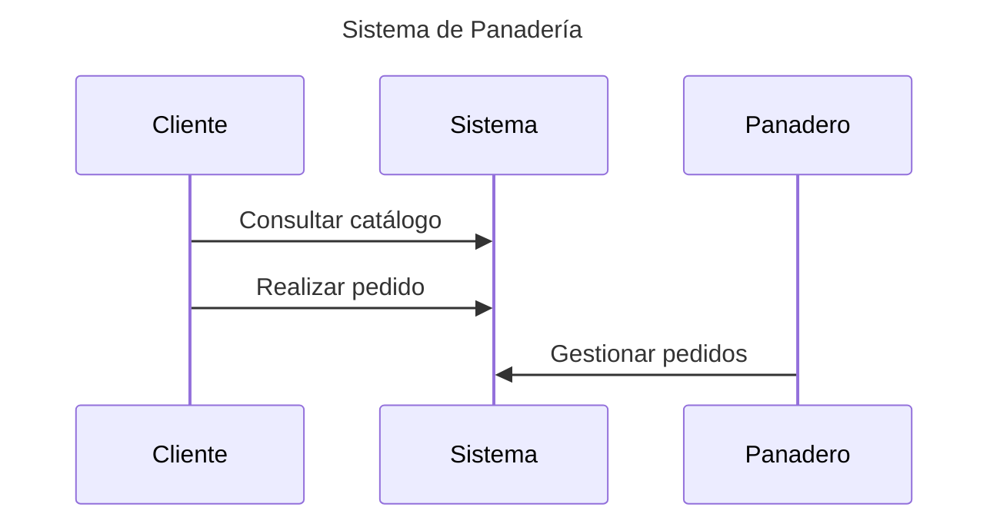
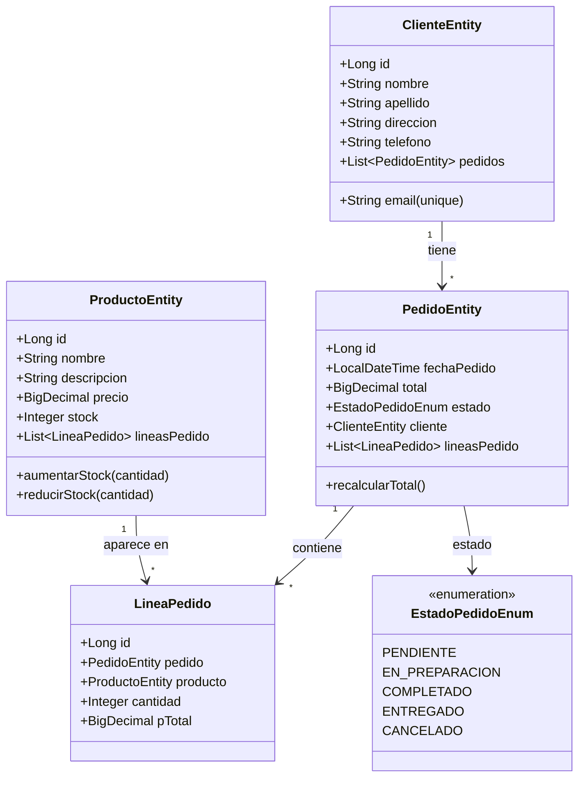
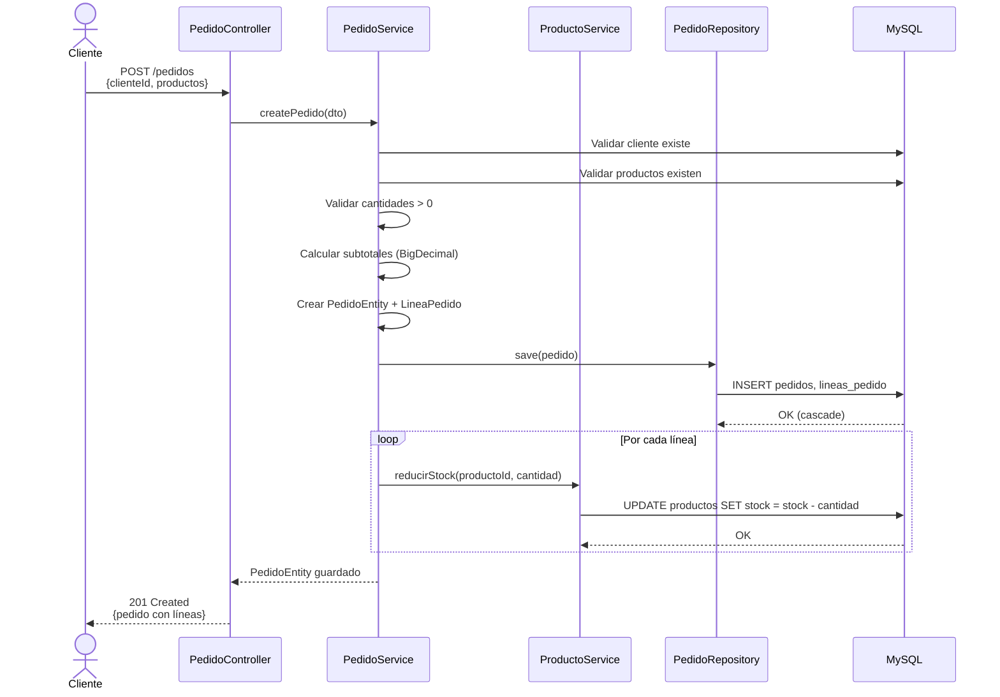
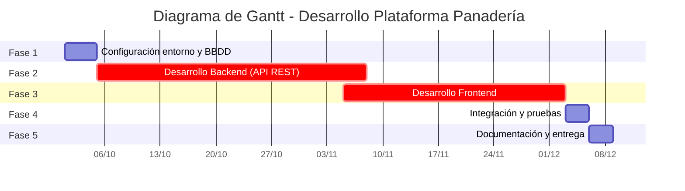

# Plataforma web de pedidos para panadería
### [RepoGitLab](https://gitlab.iessanclemente.net/dawd/a22adrianfh)

- [Introducción](#introducción)
- [Estado de arte o análisis del contexto](#estado-de-arte-o-análisis-del-contexto)
- [Propósito](#propósito)
- [Objetivos](#objetivos)
- [Alcance](#alcance)
  - [Funcionalidades incluidas:](#funcionalidades-incluidas)
  - [Límites: debido al tiempo que tengo para realizar el PFC](#límites-debido-al-tiempo-que-tengo-para-realizar-el-pfc)
  - [Contexto de uso:](#contexto-de-uso)
- [Conclusiones](#conclusiones)
- [Referencias, Fuentes consultadas y Recursos externos: Webgrafía](#referencias-fuentes-consultadas-y-recursos-externos-webgrafía)
      - [fin 1ª entrega(PFC)](#fin-1ª-entregapfc)
- [1.Análisis](#1análisis)
    - [-Diagrama de caso de uso](#-diagrama-de-caso-de-uso)
- [2. Diseño](#2-diseño)
  - [Arquitectura general](#arquitectura-general)
  - [Estructura básica del backend](#estructura-básica-del-backend)
  - [Diagrama de clases (Modelo de datos)](#diagrama-de-clases-modelo-de-datos)
  - [Diagrama de secuencia: Crear Pedido](#diagrama-de-secuencia-crear-pedido)
    - [Decisiones de diseño](#decisiones-de-diseño)
    - [Uso de Endpoints (API REST)](#uso-de-endpoints-api-rest)
      - [Endpoints de Clientes](#endpoints-de-clientes)
      - [Endpoints de Productos](#endpoints-de-productos)
      - [Endpoints de Pedidos](#endpoints-de-pedidos)
- [3.Planificación](#3planificación)
  - [Fases del proyecto](#fases-del-proyecto)
  - [Diagrama de Gantt](#diagrama-de-gantt)
  - [Estimación de recursos y costes](#estimación-de-recursos-y-costes)
  - [Conclusión](#conclusión)
      - [fin 2º entrega(PFC)](#fin-2º-entregapfc)
- [4. Implementación Técnica del Backend](#4-implementación-técnica-del-backend)
  - [4.1. Tecnologías Utilizadas](#41-tecnologías-utilizadas)
  - [4.2. Decisiones de Arquitectura](#42-decisiones-de-arquitectura)
    - [**Uso de BigDecimal en vez de Double**](#uso-de-bigdecimal-en-vez-de-double)
    - [**LineaPedido como entidad separada**](#lineapedido-como-entidad-separada)
    - [**Lifecycle Hooks para recalcular totales**](#lifecycle-hooks-para-recalcular-totales)
    - [**Prevención de recursión infinita en JSON**](#prevención-de-recursión-infinita-en-json)
    - [**Gestión de stock transaccional**](#gestión-de-stock-transaccional)
  - [4.3. Validaciones Implementadas](#43-validaciones-implementadas)
    - [**Nivel DTO** (entrada de datos)](#nivel-dto-entrada-de-datos)
    - [**Nivel Entity** (persistencia)](#nivel-entity-persistencia)
    - [**Nivel Service** (lógica de negocio)](#nivel-service-lógica-de-negocio)
  - [4.4. Logs Implementados](#44-logs-implementados)
  - [4.5. Testing Realizado](#45-testing-realizado)
    - [**Tests manuales con Postman/Thunder Client**](#tests-manuales-con-postmanthunder-client)
  - [4.6. Problemas Resueltos Durante Desarrollo](#46-problemas-resueltos-durante-desarrollo)
      - [fin 3ª entrega (Implementación Backend)](#fin-3ª-entrega-implementación-backend)

## Introducción

El presente proyecto tiene como finalidad el diseño y desarrollo de una aplicación web orientada a la gestión de pedidos en una panadería. La motivación surge de la necesidad de digitalizar procesos tradicionales en pequeños comercios, permitiendo que clientes y negocio interactúen de una forma más eficiente y moderna.

El sistema constará de un **backend desarrollado con Spring Boot** y persistencia en **MySQL**, junto con un **frontend sencillo en HTML, CSS y JavaScript**. Se busca crear un **prototipo funcional** que facilite el registro de productos, la consulta de catálogo y la realización de pedidos, constituyendo una base sólida que podría evolucionar en el futuro hacia un sistema más completo.

## Estado de arte o análisis del contexto

En la actualidad, la digitalización en pequeños negocios de alimentación sigue siendo desigual. Mientras que grandes cadenas cuentan con aplicaciones móviles o webs personalizadas, muchas panaderías y negocios locales continúan gestionando pedidos únicamente de manera presencial o telefónica.

La aplicación se orienta principalmente a:

- **Clientes** habituales que buscan comodidad y rapidez al realizar sus pedidos.
- **Propietarios de panaderías** que necesitan un método simple para organizar encargos sin recurrir a herramientas complejas o costosas.

Existen soluciones en el mercado como aplicaciones de delivery (Glovo, Uber Eats), pero resultan demasiado generales o implican costes elevados para pequeños comercios. Nuestro enfoque propone una solución ligera, adaptable y pensada **específicamente para un negocio pequeño**, sin dependencias externas.

El desarrollo abre una oportunidad de modernización para estos negocios, con un prototipo que podría evolucionar hacia una solución más robusta e incluso comercializable.

## Propósito

El propósito de este proyecto es **crear una aplicación web que facilite la gestión de pedidos en una panadería**, permitiendo a los clientes visualizar un catálogo online y realizar pedidos, y al admin gestionar dichos pedidos de forma sencilla.

El objetivo principal es la **digitalización de la panader´ia**, con una solución ligera, práctica y de fácil implementación.

## Objetivos

- Desarrollar un **backend en Spring Boot** con una API REST que gestione productos,pedidos e clientes.
- Implementar la **persistencia de datos en MySQL**.
- Diseñar un **frontend sencillo con HTML, CSS y JavaScript**, que permita al cliente navegar por el catálogo y realizar pedidos.
- Crear una interfaz básica para la **gestión de pedidos por parte del negocio**.
- Documentar el proyecto en GitLab/GitHub con instrucciones claras de instalación y uso.
- Desplegar un prototipo funcional que pueda ser probado en entorno local.

## Alcance

### Funcionalidades incluidas:

- Visualización del catálogo de productos.
- Carrito básico
- Realización de pedidos.
- Gestión interna de pedidos recibidos.
- En principio la haré sin roles pero si me da tiempo a llegar al PFC haré admin / user, si no será futura implementación.
- Persistencia en base de datos MySQL.

### Límites: debido al tiempo que tengo para realizar el PFC

- No incluirá pasarela de pago en esta primera versión.
- La autenticación será básica.
- El carrito sera básico.
- El frontend será simple (HTML/CSS/JS).
- Se desarrollará como un **prototipo funcional** para entorno local, con futura implementacion de por ejemplo un docker.

### Contexto de uso:

- Proyecto académico de fin de ciclo (DAW).
- Aplicación de ejemplo para un negocio local.
- Base para **futuras ampliaciones** (ej.: mejora del despliegue(implementacion de un Docker), integración de notificaciones,mejora del carrito,mejora del FrontEnd migrandolo a React,Roles de loggin, añadir distintas funcionalidades que pueda pedir el negocio.
- Se desarrollará un prototipo funcional con datos de prueba, no una versión en producción.).  
    

## Conclusiones

Este anteproyecto propone una solución concreta a la falta de digitalización en pequeños comercios, ofreciendo una aplicación sencilla pero funcional que puede servir como prototipo y base para futuras mejoras.

A través de este desarrollo se pondrán en práctica conocimientos de **backend con Java Spring Boot, bases de datos MySQL, y desarrollo frontend básico**, además de aplicar buenas prácticas en documentación y control de versiones con Git.

El proyecto permitirá afianzar competencias clave en desarrollo web y servirá como muestra de aplicación práctica de lo aprendido en el ciclo formativo.

## Referencias, Fuentes consultadas y Recursos externos: Webgrafía

- [Spring Boot Reference Documentation](https://docs.spring.io/spring-boot/docs/current/reference/html/)
- [MySQL Documentation](https://dev.mysql.com/doc/)
- [MDN Web Docs – HTML, CSS y JavaScript](https://developer.mozilla.org/)
- [GitLab Documentation](https://docs.gitlab.com/)
- [StackOverflow](https://stackoverflow.com/)

##### fin 1ª entrega(PFC)

# TODO
## 1.Análisis

Para el desarrollo de este proyecto se ha optado por una **metodología Kanban**, ya que permite organizar las tareas de forma visual y flexible. Dado que se trata de un proyecto individual y con tiempo limitado, además de tener que estar haciendo a la par la FCT en Santiago 8h(09:00-17:00) siendo de Noia y me consume mucho tiempo para hacer un buen PFC.

El enfoque consiste en dividir el trabajo en pequeñas tareas o fases visibles en un tablero (por ejemplo, “Do”, “Doing”, “Done”), lo que ayuda a mantener un control del avance del proyecto de forma sencilla.

Se usa un tablero Trello donde se registran las tareas principales del proyecto:

* Configuración del entorno de desarrollo (Spring Boot, MySQL, VSCode).
* Creación de la base de datos y conexión desde el backend.
* Implementación de la API REST.
* Desarrollo del frontend con HTML, CSS y JavaScript.
* Pruebas locales y documentación.

Enlace a Trello para ver el Kanban: [KanbanTrello](https://trello.com/b/DpZTdW2t/client-workflow-management) - visibilidad publica.

#### -Diagrama de caso de uso

El siguiente diagrama muestra de forma general las **interacciones principales** en la aplicación web de pedidos para panadería.

Se refleja las principales funciones del sistema sin entrar aún en detalle de roles avanzados que haré si me da tiempo antes del fin de fecha del PFC, si no lo continuaré después de ello, ya que en esta primera versión no se implementan usuarios diferenciados (admin/user), sino que se centra en el flujo básico de pedidos y del funcionamiento de la API REST con Spring Boot Java.

**Diagrama de secuencia simplificado**: Muestra las tres operaciones principales que realizan los actores en el sistema (consultar catálogo, realizar pedido, gestionar pedidos).




## 2. Diseño

El proyecto está dividido en dos partes principales:

**Backend**: Desarrollado con Spring Boot, ofrece una API REST para gestionar productos,pedidos y clientes, almacenando los datos en MySQL mediante JPA, se podrán ver logs en consola mediante el uso del Logger de SpringBoot.

**Frontend**: Página web sencilla hecha con HTML, CSS y JavaScript, que permite listar productos y realizar pedidos.

### Arquitectura general
[Cliente (HTML/JS)] --> [Spring Boot API REST] --> [Base de datos MySQL]


### Estructura básica del backend

```
com.pfcdaw.pfcdaw
 ├─ model/
 │   ├─ ClienteEntity.java
 │   ├─ ProductoEntity.java
 │   ├─ PedidoEntity.java
 │   ├─ LineaPedido.java
 │   └─ EstadoPedidoEnum.java
 ├─ dto/
 │   ├─ PedidoCreateDto.java
 │   └─ StockUpdateDto.java
 ├─ repository/
 │   ├─ ClienteRepository.java
 │   ├─ ProductoRepository.java
 │   └─ PedidoRepository.java
 ├─ service/
 │   ├─ ProductoService.java
 │   └─ PedidoService.java
 ├─ controller/
 │   ├─ ClienteController.java
 │   ├─ ProductoController.java
 │   └─ PedidoController.java
 ├─ config/
 │   └─ WebConfig.java (CORS)
 └─ PfcdawApplication.java (Main)
```

### Diagrama de clases (Modelo de datos)

Este diagrama muestra las **entidades principales** del sistema y sus **relaciones**. Cada cliente puede tener múltiples pedidos, cada pedido contiene varias líneas (LineaPedido), y cada línea referencia un producto específico con su cantidad y subtotal.



### Diagrama de secuencia: Crear Pedido

Este diagrama ilustra el **flujo completo** de creación de un pedido, desde que el cliente envía la petición HTTP hasta que se persiste en la base de datos. Muestra las **validaciones**, el **cálculo de totales** con BigDecimal, la **creación de líneas de pedido** y la **reducción automática de stock** de forma transaccional.


#### Decisiones de diseño
-Uso de de Logger para ver la info de lo que está pasando en la app por consola

- No se implementan roles ni autenticación en esta versión (MVP)

- Los datos de conexión a la base de datos se guardan en un archivo .env (Seguridad adicional)(en este caso los subiremos al github, no pondremos gitignore para mostrar el 100% en el PFC y cuando lo termine, poner el .gitignore con el .env cambiando los datos del user/pass).

- El frontend se comunica con el backend mediante fetch() con peticiones REST

- Es un prototipo funcional para ejecución local

#### Uso de Endpoints (API REST)

**Base URL**: `http://localhost:8080`

##### Endpoints de Clientes

| Método | Endpoint         | Body (JSON) | Descripción |
|--------|------------------|-------------|-------------|
| GET    | `/clientes`      | - | Listar todos los clientes |
| GET    | `/clientes/{id}` | - | Obtener cliente por ID |
| POST   | `/clientes`      | `{nombre, apellido, email, direccion, telefono}` | Crear nuevo cliente |
| PUT    | `/clientes/{id}` | `{nombre, apellido, email, direccion, telefono}` | Actualizar cliente |
| DELETE | `/clientes/{id}` | - | Eliminar cliente |

##### Endpoints de Productos

| Método | Endpoint         | Body (JSON) | Descripción |
|--------|------------------|-------------|-------------|
| GET    | `/productos`     | - | Listar todos los productos |
| GET    | `/productos/{id}` | - | Obtener producto por ID |
| POST   | `/productos`     | `{nombre, descripcion, precio, stock}` | Crear nuevo producto |
| PUT    | `/productos/{id}` | `{nombre, descripcion, precio}` | Actualizar datos del producto (NO stock) |
| DELETE | `/productos/{id}` | - | Eliminar producto |
| POST   | `/productos/{id}/AumStock` | `{cantidad}` | **Aumentar stock** del producto |

**Nota**: El stock solo se modifica mediante:
- `POST /productos/{id}/AumStock` (aumentar manualmente)
- `POST /pedidos` (reduce automáticamente al crear pedido)

##### Endpoints de Pedidos

| Método | Endpoint                   | Body (JSON) | Descripción |
|--------|----------------------------|-------------|-------------|
| GET    | `/pedidos`                 | - | Listar todos los pedidos con líneas |
| GET    | `/pedidos/{id}`            | - | Obtener pedido por ID con detalles |
| GET    | `/pedidos/cliente/{clienteId}` | - | Listar pedidos de un cliente específico |
| POST   | `/pedidos`                 | `{clienteId, productos: {productoId: cantidad}}` | **Crear pedido** (reduce stock automáticamente) |
| PUT    | `/pedidos/{id}`            | `{total, estado}` | Actualizar pedido (cambiar estado) |
| DELETE | `/pedidos/{id}`            | - | Eliminar pedido |

**Ejemplo de creación de pedido**:
```json
POST /pedidos
{
  "clienteId": 1,
  "productos": {
    "1": 2,
    "3": 1
  }
}
```
Esto crea un pedido para el cliente 1 con:
- 2 unidades del producto 1
- 1 unidad del producto 3

El sistema automáticamente:
1. Valida que cliente y productos existan
2. Valida que haya stock suficiente
3. Crea el pedido con estado PENDIENTE
4. Crea 2 líneas de pedido (LineaPedido)
5. Reduce el stock de cada producto
6. Calcula el total con precisión decimal (BigDecimal)


## 3.Planificación

Para la planificación del desarrollo se empleará una **metodología Kanban**, ya que permite una organización visual y flexible del trabajo sin una estructura rígida para gestionar las tareas del proyecto (por ejemplo: desarrollo backend, frontend, pruebas y documentación)..

### Fases del proyecto

1. **Configuración del entorno y base de datos** – 1/2 semana
2. **Desarrollo del backend (API REST y persistencia)** – 4 semanas
3. **Desarrollo del frontend (HTML, CSS, JS)** – 4 semanas
4. **Integración y pruebas locales** – 1/2 semana
5. **Documentación y entrega final** – 1 semana

### Diagrama de Gantt

**Cronograma de desarrollo**: Representa la distribución temporal de las fases del proyecto, marcando las etapas críticas (backend y frontend) y las dependencias entre tareas.



### Estimación de recursos y costes

* **Duración total estimada:** 9 semanas
* **Horas de trabajo:** aprox. 75-85 horas
* **Coste estimado (simulado,ficticio):** 20 €/h * 80h → 1600€ aprox. (non podo ir o mar mentres fago a FCT + PFC como facía mentras taba en DAW a distancia)
* **Retorno estimado (simulado,ficticio)**: x2 do que invertimos → 3200€
* **Recursos utilizados:** ordenador personal, VSCode, MySQL, Spring Boot, navegador web, conexión a internet.

### Conclusión

El desarrollo se centra en un único desarrollador, con tiempos ajustados y muy limitados con objetivos realistas. Se prioriza tener un **prototipo funcional** frente a un producto con todas las funcionalidades avanzadas que lo acabaré consiguiendo pero no llego para el PFC.


##### fin 2º entrega(PFC)

---

## 4. Implementación Técnica del Backend

### 4.1. Tecnologías Utilizadas

| Tecnología | Versión | Uso |
|------------|---------|-----|
| Java | 21 | Lenguaje base |
| Spring Boot | 3.5.7 | Framework backend |
| Spring Data JPA | 3.5.7 | Persistencia ORM |
| MySQL | 8.x | Base de datos |
| Lombok | Latest | Reducción boilerplate |
| Jakarta Validation | Latest | Validaciones |
| SLF4J | Latest | Logging |

### 4.2. Decisiones de Arquitectura

#### **Uso de BigDecimal en vez de Double**
**Problema detectado**: Al usar `Double` para precios, operaciones como `1.80 * 3` daban `3.5999999999...` por la representación binaria.

**Solución implementada**: Migración a `BigDecimal` en todos los campos monetarios:
- `ProductoEntity.precio`: `BigDecimal`
- `LineaPedido.pTotal`: `BigDecimal`
- `PedidoEntity.total`: `BigDecimal`
- Base de datos: `DECIMAL(19,2)`

**Resultado**: Precisión exacta en cálculos monetarios.

#### **LineaPedido como entidad separada**
En vez de guardar solo IDs de productos en un pedido, se creó una entidad `LineaPedido` que actúa como tabla intermedia entre `PedidoEntity` y `ProductoEntity`.

**Ventajas**:
- Permite cantidad variable por producto
- Guarda precio histórico (si el precio cambia después, el pedido mantiene el precio original)
- Permite calcular subtotales por línea

#### **Lifecycle Hooks para recalcular totales**
Se implementaron los métodos `@PrePersist` y `@PreUpdate` en `PedidoEntity` para recalcular automáticamente el total sumando las líneas:

```java
@PrePersist
@PreUpdate
public void recalcularTotal() {
    if (lineasPedido != null && !lineasPedido.isEmpty()) {
        this.total = lineasPedido.stream()
            .map(LineaPedido::getPTotal)
            .reduce(BigDecimal.ZERO, BigDecimal::add);
    } else {
        this.total = BigDecimal.ZERO;
    }
}
```

**Ventaja**: Aunque se eliminen productos (cascade) o se modifiquen líneas, el total siempre está sincronizado.

#### **Prevención de recursión infinita en JSON**
**Problema**: Al serializar `PedidoEntity` con Jackson, se generaba:
```
Pedido → lineasPedido → LineaPedido → pedido → lineasPedido → ... (∞)
```

**Solución**: Añadir `@JsonIgnore` en la referencia inversa:
```java
@ManyToOne
@JsonIgnore  // Corta la recursión
private PedidoEntity pedido;
```

#### **Gestión de stock transaccional**
El servicio `PedidoService` está anotado con `@Transactional`, lo que garantiza:
- Si falla la reducción de stock de algún producto → rollback completo
- Si falla guardar el pedido → no se reduce stock
- Atomicidad: o se completa todo o nada

### 4.3. Validaciones Implementadas

#### **Nivel DTO** (entrada de datos)
```java
@NotNull
@Size(min = 1, message = "El pedido debe tener al menos un producto")
private Map<Long, Integer> productos;
```

#### **Nivel Entity** (persistencia)
```java
@NotBlank(message = "El nombre del producto es obligatorio")
private String nombre;

@DecimalMin(value = "0.0", message = "El precio debe ser positivo")
private BigDecimal precio;
```

#### **Nivel Service** (lógica de negocio)
- Validación de cliente existente
- Validación de productos existentes
- Validación de stock suficiente
- Validación de cantidades > 0

### 4.4. Logs Implementados

Todos los controllers y services tienen logging estructurado:

**Ejemplo en ProductoController**:
```java
log.info("[POST /productos/{}] Creando nuevo producto: {}", producto.getNombre());
log.debug("[PUT /productos/{}] Antes: nombre={}, precio={}", id, producto.getNombre(), producto.getPrecio());
log.warn("[DELETE /productos/{}] Producto no encontrado", id);
```

**Nivel configurado**: `DEBUG` en desarrollo, permite ver:
- Peticiones HTTP entrantes
- Queries SQL ejecutadas
- Operaciones de negocio (creación pedido, reducción stock)

### 4.5. Testing Realizado

#### **Tests manuales con Postman/Thunder Client**

| Test | Resultado |
|------|-----------|
| Crear cliente | ✅ OK |
| Crear producto | ✅ OK |
| Crear pedido con 2 productos | ✅ OK (stock reduce correctamente) |
| Crear pedido con stock insuficiente | ✅ OK (rechaza con error) |
| Aumentar stock manualmente | ✅ OK |
| Eliminar producto usado en pedidos | ✅ OK (cascade elimina líneas, recalcula total) |
| Obtener pedidos de un cliente | ✅ OK |
| JSON sin recursión infinita | ✅ OK |
| Decimales exactos en totales | ✅ OK (BigDecimal funciona) |

### 4.6. Problemas Resueltos Durante Desarrollo

1. **Recursión infinita en JSON** → Solucionado con `@JsonIgnore`
2. **Decimales imprecisos** → Migrado de `Double` a `BigDecimal`
3. **Totales desincronizados** → Añadidos lifecycle hooks
4. **Import sin usar** → Limpiado en `PedidoController`

##### fin 3ª entrega (Implementación Backend)