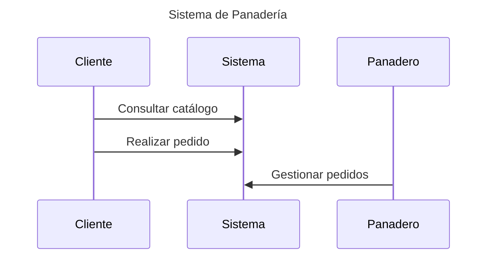
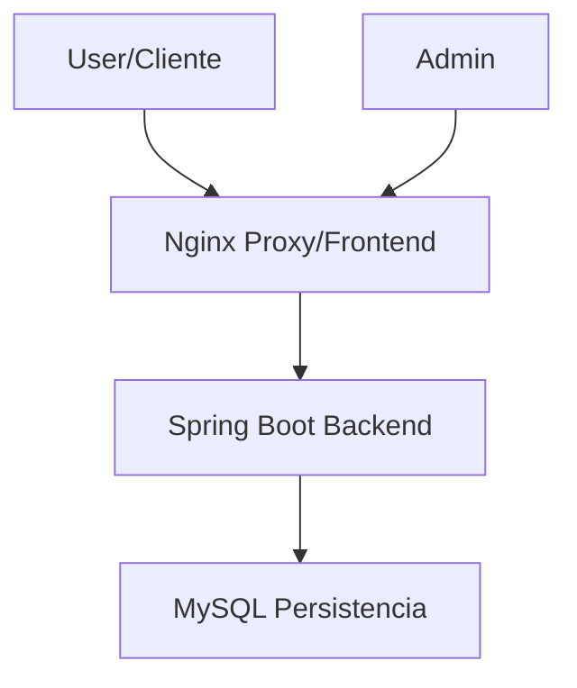
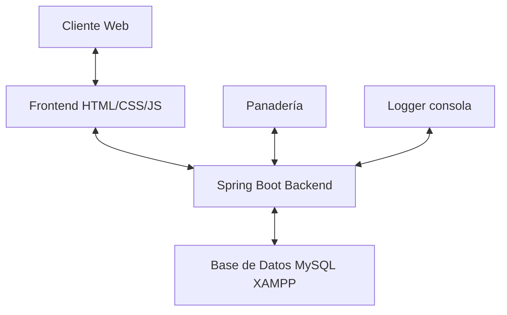
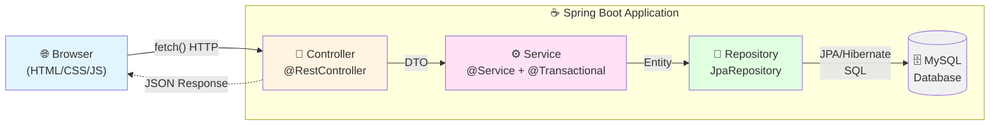
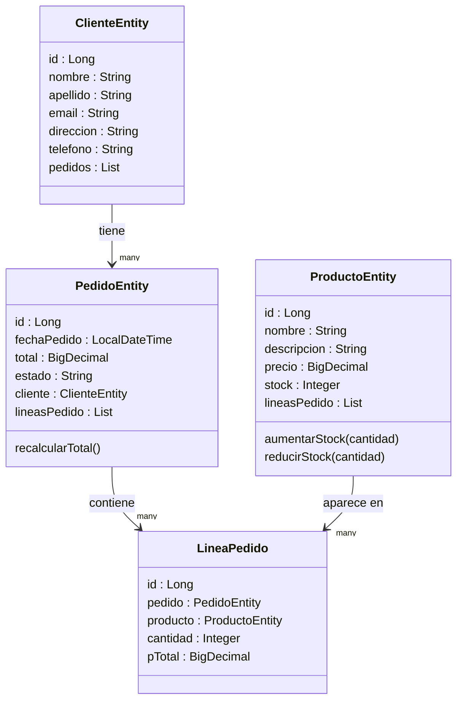
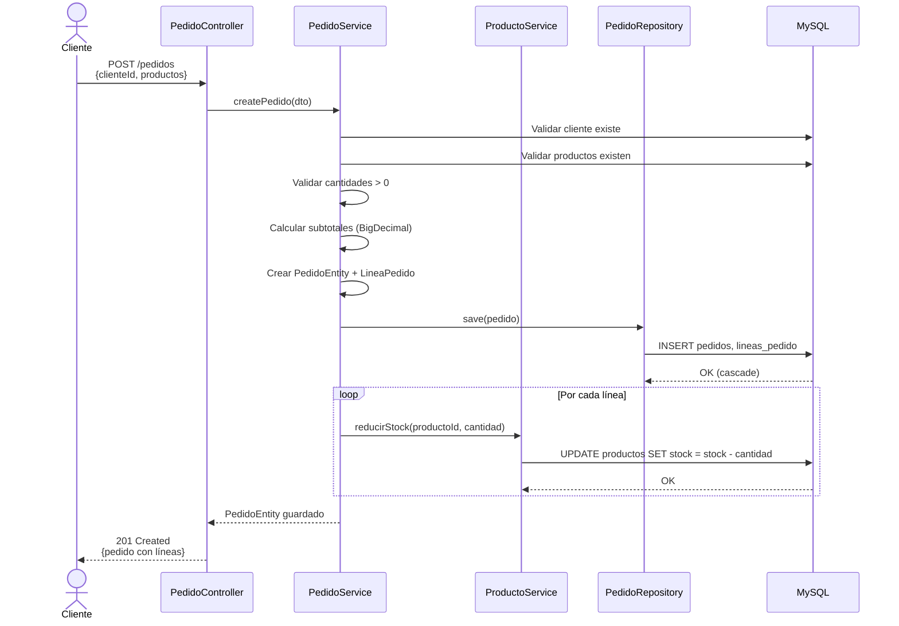
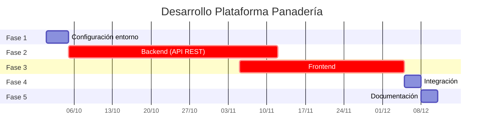

# Plataforma web de pedidos para panadería
### [RepoGitLab](https://gitlab.iessanclemente.net/dawd/a22adrianfh)

- [Plataforma web de pedidos para panadería](#plataforma-web-de-pedidos-para-panadería)
    - [RepoGitLab](#repogitlab)
  - [Introducción](#introducción)
  - [Análisis del contexto](#análisis-del-contexto)
  - [Propósito](#propósito)
  - [Objetivos](#objetivos)
  - [Alcance](#alcance)
    - [Funcionalidades incluidas:](#funcionalidades-incluidas)
    - [Límites: debido al tiempo que tengo para realizar el PFC](#límites-debido-al-tiempo-que-tengo-para-realizar-el-pfc)
    - [Contexto de uso:](#contexto-de-uso)
  - [Conclusiones](#conclusiones)
  - [Referencias, Fuentes consultadas y Recursos externos: Webgrafía](#referencias-fuentes-consultadas-y-recursos-externos-webgrafía)
        - [fin 1ª entrega(PFC)](#fin-1ª-entregapfc)
- [TODO](#todo)
  - [1.Análisis](#1análisis)
      - [-Diagrama de caso de uso](#-diagrama-de-caso-de-uso)
  - [2. Diseño](#2-diseño)
    - [Arquitectura general (Dockerizada)](#arquitectura-general-dockerizada)
    - [Alternativa: Arquitectura local (XAMPP)](#alternativa-arquitectura-local-xampp)
  - [Ventajas de usar Docker](#ventajas-de-usar-docker)
    - [¿Cómo funciona la persistencia de MySQL con Docker?](#cómo-funciona-la-persistencia-de-mysql-con-docker)
  - [Problemas comunes y soluciones](#problemas-comunes-y-soluciones)
    - [Despliegue recomendado: Docker Compose](#despliegue-recomendado-docker-compose)
    - [Localhost: XAMPP/MySQL local](#localhost-xamppmysql-local)
      - [Diagrama de Arquitectura Detallado](#diagrama-de-arquitectura-detallado)
    - [Diagrama de clases (Modelo de datos)](#diagrama-de-clases-modelo-de-datos)
    - [Diagrama de secuencia: Crear Pedido](#diagrama-de-secuencia-crear-pedido)
      - [Decisiones de diseño](#decisiones-de-diseño)
      - [Documentación de Endpoints API con Swagger/OpenAPI](#documentación-de-endpoints-api-con-swaggeropenapi)
  - [3.Planificación](#3planificación)
    - [Fases del proyecto](#fases-del-proyecto)
    - [Diagrama de Gantt](#diagrama-de-gantt)
    - [Estimación de recursos y costes](#estimación-de-recursos-y-costes)
        - [fin 2º entrega(PFC)](#fin-2º-entregapfc)
  - [4. Implementación Técnica del Backend](#4-implementación-técnica-del-backend)
    - [4.1. Tecnologías Utilizadas](#41-tecnologías-utilizadas)
    - [4.2. Decisiones de Arquitectura](#42-decisiones-de-arquitectura)
      - [**Uso de BigDecimal en vez de Double**](#uso-de-bigdecimal-en-vez-de-double)
      - [**LineaPedido como entidad separada**](#lineapedido-como-entidad-separada)
      - [**Lifecycle Hooks para recalcular totales**](#lifecycle-hooks-para-recalcular-totales)
      - [**Prevención de recursión infinita en JSON**](#prevención-de-recursión-infinita-en-json)
      - [**Gestión de stock transaccional**](#gestión-de-stock-transaccional)
    - [4.3. Validaciones Implementadas](#43-validaciones-implementadas)
      - [**Nivel DTO** (entrada de datos)](#nivel-dto-entrada-de-datos)
      - [**Nivel Entity** (persistencia)](#nivel-entity-persistencia)
      - [**Nivel Service** (lógica de negocio)](#nivel-service-lógica-de-negocio)
    - [4.4. Logs Implementados](#44-logs-implementados)
    - [4.5. Problemas Resueltos Durante Desarrollo](#45-problemas-resueltos-durante-desarrollo)
        - [fin 3ª entrega (Implementación Backend)](#fin-3ª-entrega-implementación-backend)
  - [5. Implementación Técnica del Frontend](#5-implementación-técnica-del-frontend)
    - [5.1. Tecnologías y Bibliotecas](#51-tecnologías-y-bibliotecas)
    - [5.2. Estructura de Archivos](#52-estructura-de-archivos)
    - [5.3. Arquitectura Frontend](#53-arquitectura-frontend)
      - [**Comunicación con API REST mediante Fetch**](#comunicación-con-api-rest-mediante-fetch)
      - [**Modales Reutilizables con Estado**](#modales-reutilizables-con-estado)
      - [**Renderizado Dinámico con Template Literals**](#renderizado-dinámico-con-template-literals)
    - [5.4. Funcionalidades Implementadas](#54-funcionalidades-implementadas)
      - [**Sistema de Tabs (dashboard.html)**](#sistema-de-tabs-dashboardhtml)
      - [**DataTables: Búsqueda, Ordenación, Paginación**](#datatables-búsqueda-ordenación-paginación)
      - [**Sistema de Badges de Color**](#sistema-de-badges-de-color)
      - [**Alertas de Stock Bajo**](#alertas-de-stock-bajo)
      - [**Gestión de Stock Separada**](#gestión-de-stock-separada)
      - [**Modal de Detalles de Pedido (Vista Usuario)**](#modal-de-detalles-de-pedido-vista-usuario)
      - [**Autenticación con localStorage**](#autenticación-con-localstorage)
      - [**Validaciones Frontend**](#validaciones-frontend)
    - [5.5. Decisiones Técnicas](#55-decisiones-técnicas)
      - [**Vanilla JavaScript vs Frameworks**](#vanilla-javascript-vs-frameworks)
      - [**Bootstrap como Framework CSS**](#bootstrap-como-framework-css)
      - [**DataTables para Tablas Interactivas**](#datatables-para-tablas-interactivas)
      - [**Separación de Concerns**](#separación-de-concerns)
    - [5.6. Limitaciones](#56-limitaciones)
      - [**Estado cliente-servidor (stateless)**](#estado-cliente-servidor-stateless)
      - [**Estado Actual del Sistema de Autenticación**](#estado-actual-del-sistema-de-autenticación)
      - [**Justificación de Decisiones Técnicas**](#justificación-de-decisiones-técnicas)
        - [fin 4ª entrega](#fin-4ª-entrega)
  - [6. Propuestas de  / Roadmap](#6-propuestas-de---roadmap)
    - [6.1. Mejoras de Seguridad (Prioridad Alta)](#61-mejoras-de-seguridad-prioridad-alta)
    - [6.2. Mejoras Funcionales](#62-mejoras-funcionales)
    - [6.3. Mejoras de Experiencia de Usuario](#63-mejoras-de-experiencia-de-usuario)
    - [6.4. Mejoras Técnicas](#64-mejoras-técnicas)
    - [6.5. Mejoras de Negocio](#65-mejoras-de-negocio)
  - [7. Conclusiones Finales del Proyecto](#7-conclusiones-finales-del-proyecto)
    - [7.1. Objetivos Alcanzados](#71-objetivos-alcanzados)
    - [7.2. Dificultades Encontradas y Soluciones](#72-dificultades-encontradas-y-soluciones)
    - [7.3. Lecciones Aprendidas](#73-lecciones-aprendidas)
    - [7.4. Estado Final del Proyecto](#74-estado-final-del-proyecto)
    - [7.5. Valoración Personal](#75-valoración-personal)
    - [7.6. Aplicabilidad Real](#76-aplicabilidad-real)
  - [8. Cobertura de rúbrica](#8-cobertura-de-rúbrica)
        - [fin documentación PFC](#fin-documentación-pfc)

## Introducción

El presente proyecto tiene como finalidad el diseño y desarrollo de una aplicación web orientada a la gestión de pedidos en una panadería. La motivación surge de la necesidad de digitalizar procesos tradicionales en pequeños comercios, permitiendo que clientes y negocio interactúen de una forma más eficiente y moderna.

El sistema constará de un **backend desarrollado con Spring Boot** y persistencia en **MySQL**, junto con un **frontend sencillo en HTML, CSS y JavaScript**. Se busca crear un **prototipo funcional** que facilite el registro de productos, la consulta de catálogo y la realización de pedidos, constituyendo una base sólida que podría evolucionar en el futuro hacia un sistema más completo.

## Análisis del contexto

En la actualidad, la digitalización en pequeños negocios de alimentación sigue siendo desigual. Mientras que grandes cadenas cuentan con aplicaciones móviles o webs personalizadas, muchas panaderías y negocios locales continúan gestionando pedidos únicamente de manera presencial o telefónica.

La aplicación se orienta principalmente a:

- **Clientes** habituales que buscan comodidad y rapidez al realizar sus pedidos.
- **Propietarios de panaderías** que necesitan un método simple para organizar encargos sin recurrir a herramientas complejas o costosas.

Existen soluciones en el mercado como aplicaciones de delivery (Glovo, Uber Eats), pero resultan demasiado generales o implican costes elevados para pequeños comercios. Nuestro enfoque propone una solución ligera, adaptable y pensada **específicamente para un negocio pequeño**, sin dependencias externas.

El desarrollo abre una oportunidad de modernización para estos negocios, con un prototipo que podría evolucionar hacia una solución más robusta e incluso comercializable.

## Propósito

El propósito de este proyecto es **crear una aplicación web que facilite la gestión de pedidos en una panadería**, permitiendo a los clientes visualizar un catálogo online y realizar pedidos, y al admin gestionar dichos pedidos de forma sencilla.

El objetivo principal es la **digitalización de la panader´ia**, con una solución ligera, práctica y de fácil implementación.

## Objetivos

- Desarrollar un **backend en Spring Boot** con una API REST que gestione productos,pedidos e clientes.
- Implementar la **persistencia de datos en MySQL**.
- Diseñar un **frontend sencillo con HTML, CSS y JavaScript**, que permita al cliente navegar por el catálogo y realizar pedidos.
- Crear una interfaz básica para la **gestión de pedidos por parte del negocio**.
- Documentar el proyecto en GitLab/GitHub con instrucciones claras de instalación y uso.
- Desplegar un prototipo funcional que pueda ser probado en entorno local.

## Alcance

### Funcionalidades incluidas:

- Carrito básico
- Realización del cliente de pedidos.
- Gestión admin de pedidos recibidos y cambiar estado.
- Gestión admin de añadir/editar/deletear clientes.
- Gestión admin de añadir/editar/editar multimedia/deletear productos.
- Visualización de fotos de productos.
- Roles admin / user.
- Validaciones.
- Logs.
- Gestión de errores básica.
- Desplegable con cerrar sesión.
- Ordenacion y mejor visualización de las tablas de Bootstrap con el DataTables.
- Persistencia en base de datos MySQL.

### Límites: debido al tiempo que tengo para realizar el PFC

- No incluirá pasarela de pago en esta primera versión.
- La autenticación será básica.
- El carrito sera básico.
- El frontend será simple (HTML/CSS/JS/BOOTSTRAP).
- Gestión de categorías de productos(panadería,bollería,postres...)
- Web inicial.
- SpringBoot Security

### Contexto de uso:

- Proyecto académico de fin de ciclo (DAW).
- Aplicación de ejemplo para un negocio local.
- Base para **futuras ampliaciones** (ver detalles en la sección 6.
- Prototipo funcional con datos de prueba, no una versión en producción.).  
    

## Conclusiones

Este anteproyecto propone una solución concreta a la falta de digitalización en pequeños comercios, ofreciendo una aplicación sencilla pero funcional que puede servir como prototipo y base para futuras mejoras.

A través de este desarrollo se pondrán en práctica conocimientos de **backend con Java Spring Boot, bases de datos MySQL, y desarrollo frontend básico**, además de aplicar buenas prácticas en documentación y control de versiones con Git.

El proyecto permitirá afianzar competencias clave en desarrollo web y servirá como muestra de aplicación práctica de lo aprendido en el ciclo formativo.

## Referencias, Fuentes consultadas y Recursos externos: Webgrafía

- [Spring Boot Reference Documentation](https://docs.spring.io/spring-boot/docs/current/reference/html/)
- [MySQL Documentation](https://dev.mysql.com/doc/)
- [MDN Web Docs – HTML, CSS y JavaScript](https://developer.mozilla.org/)
- [GitLab Documentation](https://docs.gitlab.com/)
- [StackOverflow](https://stackoverflow.com/)

##### fin 1ª entrega(PFC)

# TODO
## 1.Análisis

Para el desarrollo de este proyecto se ha optado por una **metodología Kanban**, ya que permite organizar las tareas de forma visual y flexible. Dado que se trata de un proyecto individual y con tiempo limitado, además de tener que estar haciendo a la par la FCT en Santiago 8h(09:00-17:00) siendo de Noia y me consume mucho tiempo para hacer un buen PFC.

El enfoque consiste en dividir el trabajo en pequeñas tareas o fases visibles en un tablero (por ejemplo, “Do”, “Doing”, “Done”), lo que ayuda a mantener un control del avance del proyecto de forma sencilla.

Se usa un tablero Trello donde se registran las tareas principales del proyecto:

* Configuración del entorno de desarrollo (Spring Boot, MySQL, VSCode).
* Creación de la base de datos y conexión desde el backend.
* Implementación de la API REST.
* Desarrollo del frontend con HTML, CSS y JavaScript.
* Pruebas locales y documentación.

Enlace a Trello para ver el Kanban: [KanbanTrello](https://trello.com/b/DpZTdW2t/client-workflow-management) - visibilidad publica.

#### -Diagrama de caso de uso

El siguiente diagrama muestra de forma general las **interacciones principales** en la aplicación web de pedidos para panadería.

Se refleja las principales funciones del sistema, con el detalle del uso de roles avanzados (admin/user), se centra en el flujo básico de pedidos y del funcionamiento de la API REST con Spring Boot Java.

**Diagrama de secuencia simplificado**: Muestra las tres operaciones principales que realizan los actores en el sistema (consultar catálogo, realizar pedido, gestionar pedidos).


```mermaid
---
title: Sistema de Panadería
---
sequenceDiagram
    Cliente->>Sistema: Consultar catálogo
    Cliente->>Sistema: Realizar pedido
    Panadero->>Sistema: Gestionar pedidos
```


## 2. Diseño

El proyecto está dividido en tres partes principales:

**BaseDatos**: MySQL

**Backend**: Desarrollado con Spring Boot, ofrece una API REST para gestionar productos,pedidos y clientes, almacenando los datos en MySQL mediante JPA, se podrán ver logs en consola mediante el uso del Logger de SpringBoot.

**Frontend**: Página web sencilla hecha con HTML, CSS, Bootstrap y JavaScript, que permite listar productos y realizar pedidos.


### Arquitectura general (Dockerizada)

```mermaid
graph TD
    Nginx[Nginx Proxy/Frontend]
    Backend[Spring Boot Backend]
    MySQL[MySQL Persistencia]
    User[User/Cliente]
    Panaderia[Admin]
    User --> Nginx
    Panaderia --> Nginx
    Nginx --> Backend
    Backend --> MySQL
```

### Alternativa: Arquitectura local (XAMPP)

```mermaid
graph TD
    A[Frontend HTML/CSS/JS] <--> B[Spring Boot Backend]
    B <--> C[Base de Datos MySQL XAMPP]
    E[Cliente Web] <--> A
    F[Panadería] <--> B
    G[Logger consola] <--> B
```

## Ventajas de usar Docker

- **Portabilidad:** El proyecto funciona igual en cualquier máquina con Docker, sin importar el sistema operativo.
- **Persistencia:** Los datos de MySQL se guardan en un volumen, así no se pierden aunque borres los contenedores.
- **Fácil despliegue:** Un solo comando (`docker-compose up --build`) levanta toda la plataforma.
- **Aislamiento:** Cada servicio corre en su propio contenedor, evitando conflictos de dependencias.

### ¿Cómo funciona la persistencia de MySQL con Docker?

En el archivo `docker-compose.yml` se define un volumen llamado `mysql_panaderia`:

```yaml
volumes:
    mysql_panaderia:
```

Esto hace que los datos de la base de datos se almacenen fuera del contenedor, en el sistema de archivos del host. Así, aunque borres o actualices el contenedor de MySQL, los datos permanecen.

Para ver dónde está el volumen en tu máquina, ejecuta:
```bash
docker volume inspect mysql_panaderia
```

Para borrar todos los datos:
```bash
docker volume rm mysql_panaderia
```

## Problemas comunes y soluciones

- **El puerto 3306 está ocupado:** Para el servicio MySQL de XAMPP o cualquier otro MySQL local antes de usar Docker.
- **Permisos en volúmenes:** Si tienes errores de permisos, prueba a borrar el volumen y crearlo de nuevo.
- **No se ven los cambios en el frontend:** Asegúrate de que el volumen de archivos estáticos está bien mapeado en `docker-compose.yml`.
- **No arranca algún servicio:** Usa `docker compose logs <servicio>` para ver los errores detallados.

### Despliegue recomendado: Docker Compose

1. Clona el repositorio y entra en la carpeta donde esten los dockerfile, compose...:
    ```bash
    cd PFC/pfcdaw
    docker-compose up
    ```
    Esto levanta MySQL, backend y Nginx con persistencia de datos.

2. Accede a la app en [http://localhost:8081](http://localhost:8081)

3. Comandos Docker útiles:
    - Parar: `docker compose down`
    - Logs: `docker compose logs -f`
    - Reconstruir: `docker compose up --build`

### Localhost: XAMPP/MySQL local

**Para usar localhost:**
- Como uso variables de entorno si arrancas con docker leera las variables de entorno y estaras en docker, si no si arrancas desde el main o comandos te ira al localhost


#### Diagrama de Arquitectura Detallado

Este diagrama muestra el **flujo completo de una petición** desde el navegador hasta la base de datos, incluyendo todas las capas de la arquitectura backend:


```mermaid
flowchart LR
    Browser["🌐 Browser<br/>(HTML/CSS/JS)"] -->|"fetch() HTTP"| Controller
    
    subgraph SpringBoot["☕ Spring Boot Application"]
        Controller["📡 Controller<br/>@RestController"] -->|DTO| Service
        Service["⚙️ Service<br/>@Service + @Transactional"] -->|Entity| Repository
        Repository["💾 Repository<br/>JpaRepository"] -->|"JPA/Hibernate<br/>SQL"| DB
    end
    
    DB[("🗄️ MySQL<br/>Database")]
    
    Controller -.->|"JSON Response"| Browser
    
    style Browser fill:#e1f5ff
    style Controller fill:#fff4e1
    style Service fill:#ffe1f5
    style Repository fill:#e1ffe1
    style DB fill:#f0f0f0
```

**Flujo de ejemplo - Crear Pedido**:
1. Usuario hace clic en "Crear Pedido" → `fetch('/pedidos', { method: 'POST', body: pedidoDto })`
2. **Controller** (`PedidoController`) recibe `PedidoCreateDto` y llama a `pedidoService.createPedido(dto)`
3. **Service** (`PedidoService`) valida datos, crea entidades `PedidoEntity` + `LineaPedido`, reduce stock
4. **Repository** (`PedidoRepository`) persiste en BD mediante JPA (cascade guarda líneas automáticamente)
5. **MySQL** ejecuta `INSERT INTO pedidos`, `INSERT INTO lineas_pedido`, `UPDATE productos SET stock = stock - cantidad`
6. Response JSON con pedido creado regresa por la cadena hasta el navegador
7. JavaScript actualiza la tabla sin recargar página

**Ventajas de esta arquitectura**:
- **Separación de capas**: Controller maneja HTTP, Service lógica de negocio, Repository persistencia
- **Transaccionalidad**: `@Transactional` en Service garantiza rollback si falla alguna operación
- **DTOs**: Evitan exponer entidades JPA directamente, permiten validaciones con Jakarta
- **JPA Cascade**: Simplifica persistencia de relaciones (guardar pedido guarda líneas automáticamente)

### Diagrama de clases (Modelo de datos)

Este diagrama muestra las **entidades principales** del sistema y sus **relaciones**. Cada cliente puede tener múltiples pedidos, cada pedido contiene varias líneas (LineaPedido), y cada línea referencia un producto específico con su cantidad y subtotal.


```mermaid
classDiagram
    class ClienteEntity {
        id : Long
        nombre : String
        apellido : String
        email : String
        direccion : String
        telefono : String
        pedidos : List
    }
    
    class ProductoEntity {
        id : Long
        nombre : String
        descripcion : String
        precio : BigDecimal
        stock : Integer
        lineasPedido : List
        aumentarStock(cantidad)
        reducirStock(cantidad)
    }
    
    class PedidoEntity {
        id : Long
        fechaPedido : LocalDateTime
        total : BigDecimal
        estado : String
        cliente : ClienteEntity
        lineasPedido : List
        recalcularTotal()
    }
    
    class LineaPedido {
        id : Long
        pedido : PedidoEntity
        producto : ProductoEntity
        cantidad : Integer
        pTotal : BigDecimal
    }
    
    ClienteEntity --> "many" PedidoEntity : tiene
    PedidoEntity --> "many" LineaPedido : contiene
    ProductoEntity --> "many" LineaPedido : aparece en
```

### Diagrama de secuencia: Crear Pedido

Este diagrama ilustra el **flujo completo** de creación de un pedido, desde que el cliente envía la petición HTTP hasta que se persiste en la base de datos. Muestra las **validaciones**, el **cálculo de totales** con BigDecimal, la **creación de líneas de pedido** y la **reducción automática de stock** de forma transaccional.


```mermaid
sequenceDiagram
    actor Cliente
    participant Controller as PedidoController
    participant Service as PedidoService
    participant ProdService as ProductoService
    participant Repository as PedidoRepository
    participant DB as MySQL
    
    Cliente->>Controller: POST /pedidos<br/>{clienteId, productos}
    Controller->>Service: createPedido(dto)
    
    Service->>DB: Validar cliente existe
    Service->>DB: Validar productos existen
    Service->>Service: Validar cantidades > 0
    Service->>Service: Calcular subtotales (BigDecimal)
    Service->>Service: Crear PedidoEntity + LineaPedido
    
    Service->>Repository: save(pedido)
    Repository->>DB: INSERT pedidos, lineas_pedido
    DB-->>Repository: OK (cascade)
    
    loop Por cada línea
        Service->>ProdService: reducirStock(productoId, cantidad)
        ProdService->>DB: UPDATE productos SET stock = stock - cantidad
        DB-->>ProdService: OK
    end
    
    Service-->>Controller: PedidoEntity guardado
    Controller-->>Cliente: 201 Created<br/>{pedido con líneas}
```
#### Decisiones de diseño
-Uso de de Logger para ver la info de lo que está pasando en la app por consola

- Autenticación implementada en frontend con roles (ADMIN/USER) y sesiones en localStorage; seguridad backend pendiente (ver sección 6: [Propuestas de Mejora](#6-propuestas-de-mejora), Spring Security/JWT)

- Los datos de conexión a la base de datos se guardan en un archivo .env (Seguridad adicional)(en este caso los subiremos al github, no pondremos gitignore para mostrar el 100% en el PFC y cuando lo termine, poner el .gitignore con el .env cambiando los datos del user/pass).

- El frontend se comunica con el backend mediante fetch() con peticiones REST

- Es un prototipo funcional para ejecución local

#### Documentación de Endpoints API con Swagger/OpenAPI

Se ha integrado **Swagger UI** para documentación interactiva de la API REST. Permite visualizar todos los endpoints, sus parámetros, y probar peticiones directamente desde el navegador.

**Acceso a Swagger UI**: `http://localhost:8081/swagger-ui/index.html`

**Probar Swagger**: Usar el boton al lado de cada metodo de "Try It OUT"

**Ventajas**:
- Documentación automática generada desde los controllers
- Interfaz visual para probar endpoints sin Postman
- Exportación de especificación OpenAPI 3.0 (JSON/YAML)
- Actualización automática al modificar código

**Recursos principales documentados**:
- **Clientes**: GET/POST/DELETE (`/clientes`)
- **Productos**: CRUD completo + gestión de stock (`/productos`, `/productos/{id}/AumStock`, `/productos/{id}/RedStock`)
- **Pedidos**: GET/POST/PUT para gestión de estados (`/pedidos`, `/pedidos/cliente/{id}`, `/pedidos/{id}/estado`)

**Nota**: El stock se gestiona mediante endpoints dedicados o automáticamente al crear pedidos.


## 3.Planificación

Para la planificación del desarrollo se empleará una **metodología Kanban**, ya que permite una organización visual y flexible del trabajo sin una estructura rígida para gestionar las tareas del proyecto (por ejemplo: desarrollo backend, frontend, pruebas y documentación)..

### Fases del proyecto

1. **Configuración del entorno y base de datos** – 1/2 semana
2. **Desarrollo del backend (API REST y persistencia)** – 5 semanas
3. **Desarrollo del frontend (HTML, CSS, JS)** – 4 semanas
4. **Integración y pruebas locales** – 1/2 semana
5. **Documentación y entrega final** – 1 semana

### Diagrama de Gantt


```mermaid
gantt
    title Desarrollo Plataforma Panadería
    dateFormat  YYYY-MM-DD
    axisFormat %d/%m
    section Fase 1
    Configuración entorno :2024-10-01, 4d
    section Fase 2
    Backend (API REST) :crit, 2024-10-05, 38d
    section Fase 3
    Frontend :crit, 2024-11-5, 30d
    section Fase 4
    Integración :2024-12-05, 3d
    section Fase 5
    Documentación :2024-12-08, 3d
```

### Estimación de recursos y costes

* **Duración:** 9 semanas (~75-85 horas)
* **Coste simulado:** 20 €/h * 80h → 1600€
* **Retorno estimado(fictio):** 3000€
* **Recursos:** ordenador personal, VSCode, MySQL, Spring Boot, conexión a internet


##### fin 2º entrega(PFC)

---

## 4. Implementación Técnica del Backend

### 4.1. Tecnologías Utilizadas

| Tecnología | Versión | Uso |
|------------|---------|-----|
| Java | 21 | Lenguaje base |
| Spring Boot | 3.5.7 | Framework backend |
| Spring Data JPA | 3.5.7 | Persistencia ORM |
| MySQL | 8.0 | Base de datos |
| Lombok | Latest | Reducción boilerplate |
| Jakarta Validation | Latest | Validaciones |
| SLF4J | Latest | Logging |
| SpringDoc OpenAPI | Documentación API (Swagger UI) |

### 4.2. Decisiones de Arquitectura

#### **Uso de BigDecimal en vez de Double**
**Problema detectado**: Al usar `Double` para precios, operaciones como `1.80 * 3` daban `3.5999999999...` por la representación binaria.

**Solución implementada**: Migración a `BigDecimal` en todos los campos monetarios:
- `ProductoEntity.precio`: `BigDecimal`
- `LineaPedido.pTotal`: `BigDecimal`
- `PedidoEntity.total`: `BigDecimal`
- Base de datos: `DECIMAL(19,2)`

**Resultado**: Precisión exacta en cálculos monetarios.

#### **LineaPedido como entidad separada**
En vez de guardar solo IDs de productos en un pedido, se creó una entidad `LineaPedido` que actúa como tabla intermedia entre `PedidoEntity` y `ProductoEntity`.

**Ventajas**:
- Permite cantidad variable por producto
- Guarda precio histórico (si el precio cambia después, el pedido mantiene el precio original)
- Permite calcular subtotales por línea

#### **Lifecycle Hooks para recalcular totales**
Se implementaron los métodos `@PrePersist` y `@PreUpdate` en `PedidoEntity` para recalcular automáticamente el total sumando las líneas:

```java
@PrePersist
@PreUpdate
public void recalcularTotal() {
    if (lineasPedido != null && !lineasPedido.isEmpty()) {
        this.total = lineasPedido.stream()
            .map(LineaPedido::getPTotal)
            .reduce(BigDecimal.ZERO, BigDecimal::add);
    } else {
        this.total = BigDecimal.ZERO;
    }
}
```

**Ventaja**: Aunque se eliminen productos (cascade) o se modifiquen líneas, el total siempre está sincronizado.

#### **Prevención de recursión infinita en JSON**
**Problema**: Al serializar `PedidoEntity` con Jackson, se generaba:
```
Pedido → lineasPedido → LineaPedido → pedido → lineasPedido → ... (∞)
```

**Solución**: Añadir `@JsonIgnore` en la referencia inversa:
```java
@ManyToOne
@JsonIgnore  // Corta la recursión
private PedidoEntity pedido;
```

#### **Gestión de stock transaccional**
El servicio `PedidoService` está anotado con `@Transactional`, lo que garantiza:
- Si falla la reducción de stock de algún producto → rollback completo
- Si falla guardar el pedido → no se reduce stock
- Atomicidad: o se completa todo o nada

### 4.3. Validaciones Implementadas

#### **Nivel DTO** (entrada de datos)
```java
@NotNull
@Size(min = 1, message = "El pedido debe tener al menos un producto")
private Map<Long, Integer> productos;
```

#### **Nivel Entity** (persistencia)
```java
@NotBlank(message = "El nombre del producto es obligatorio")
private String nombre;

@DecimalMin(value = "0.0", message = "El precio debe ser positivo")
private BigDecimal precio;
```

#### **Nivel Service** (lógica de negocio)
- Validación de cliente existente
- Validación de productos existentes
- Validación de stock suficiente
- Validación de cantidades > 0

### 4.4. Logs Implementados

Todos los controllers y services tienen logging estructurado:

**Ejemplo en ProductoController**:
```java
log.info("[POST /productos/{}] Creando nuevo producto: {}", producto.getNombre());
log.debug("[PUT /productos/{}] Antes: nombre={}, precio={}", id, producto.getNombre(), producto.getPrecio());
log.warn("[DELETE /productos/{}] Producto no encontrado", id);
```

**Nivel configurado**: `DEBUG` en desarrollo, permite ver:
- Peticiones HTTP entrantes
- Queries SQL ejecutadas
- Operaciones de negocio (creación pedido, reducción stock)

### 4.5. Problemas Resueltos Durante Desarrollo

1. **Recursión infinita en JSON** → Solucionado con `@JsonIgnore`
2. **Decimales imprecisos** → Migrado de `Double` a `BigDecimal`
3. **Totales desincronizados** → Añadidos lifecycle hooks

##### fin 3ª entrega (Implementación Backend)

---

## 5. Implementación Técnica del Frontend

### 5.1. Tecnologías y Bibliotecas

| Tecnología | Versión | Uso |
|------------|---------|-----|
| HTML5 | - | Estructura semántica |
| CSS3 + Bootstrap | 5.3.8 | Estilos y componentes UI |
| JavaScript (Vanilla) | ES6+ | Lógica cliente, fetch API |
| jQuery | 3.7.0 | Requerido por DataTables |
| DataTables | 2.3.5 | Tablas interactivas |
| DataTables Buttons | 3.2.5 | Exportación datos |
| Bootstrap Icons | 1.11.3 | Iconografía |
| JSZip | 3.10.1 | Exportación Excel |
| pdfmake | 0.2.7 | Exportación PDF |

### 5.2. Estructura de Archivos

```
resources/static/
├── login.html              # Autenticación básica
├── dashboard.html          # Panel admin (tabs)
├── mis-pedidos.html        # Vista cliente
├── css/
│   ├── stylesLogin.css
│   ├── dashboard.css
│   └── mis-pedidos.css
├── js/
│   ├── login.js            # Lógica autenticación
│   ├── clientes.js         # CRUD clientes
│   ├── productos.js        # CRUD productos + stock
│   ├── pedidos.js          # Gestión pedidos admin
│   ├── pedidosClientes.js  # Vista pedidos usuario
│   └── crearPedidoCliente.js  # Carrito y creación pedido
└── img/
```

### 5.3. Arquitectura Frontend

#### **Comunicación con API REST mediante Fetch**
Todas las operaciones con el backend usan `fetch()` con manejo de promesas:

```javascript
fetch('/productos')
    .then(response => response.json())
    .then(data => cargarTablaProductos(data))
    .catch(error => console.error('Error:', error));
```

#### **Modales Reutilizables con Estado**
Se usan variables globales (`modoEdicion`, `idActual`) para reutilizar modales en crear/editar:

```javascript
let modoEdicion = false;
let productoIdActual = null;

function modalCrearProducto() {
    modoEdicion = false;
    document.getElementById('formProducto').reset();
    // Abrir modal...
}

function modalEditarProducto(id) {
    modoEdicion = true;
    productoIdActual = id;
    // Cargar datos y abrir modal...
}
```

**Ventaja**: Reduce duplicación de HTML, un solo modal maneja crear y editar.

#### **Renderizado Dinámico con Template Literals**
Las tablas se construyen dinámicamente usando template strings de ES6:

```javascript
data.forEach(producto => {
    tablaHTML += `
        <tr>
            <td>${producto.id}</td>
            <td>${producto.nombre}</td>
            <td${producto.stock < 10 ? ' class="bg-danger text-dark fw-bold"' : ''}>
                ${producto.stock < 10 ? '⚠️ ' : ''}${producto.stock}
            </td>
        </tr>
    `;
});
```

**Técnica destacada**: Operador ternario dentro de `${}` para renderizado condicional de clases CSS y contenido.

### 5.4. Funcionalidades Implementadas

#### **Sistema de Tabs (dashboard.html)**
Panel admin con navegación por pestañas sin recarga de página:
- **Tab Clientes**: Crear/eliminar clientes, badges de rol (ADMIN/USER)
- **Tab Productos**: CRUD completo + gestión stock independiente
- **Tab Pedidos**: Ver todos los pedidos, cambiar estado, ver detalles

#### **DataTables: Búsqueda, Ordenación, Paginación**
Integración de DataTables en todas las tablas con configuración española:

```javascript
$('#tablaProductos table').DataTable({
    language: {
        url: '//cdn.datatables.net/plug-ins/2.3.5/i18n/es-ES.json'
    },
    dom: 'Bfrtip',
    buttons: [
        { extend: 'copy', text: 'Copiar' },
        { extend: 'csv', text: 'CSV' },
        { extend: 'excel', text: 'Excel', title: 'Lista de Productos' },
        { extend: 'pdf', text: 'PDF', orientation: 'landscape' },
        { extend: 'print', text: 'Imprimir' }
    ]
});
```

**Funciones incluidas**:
- Búsqueda en tiempo real
- Ordenación por columnas
- Paginación configurable
- Exportación a CSV, Excel, PDF, Copiar, Imprimir

#### **Sistema de Badges de Color**
Indicadores visuales para estados y roles usando clases Bootstrap:

**Estados de pedido** (pedidos.js):
```javascript
function getBadgeClass(estado) {
    switch(estado) {
        case 'PENDIENTE': return 'bg-warning';
        case 'EN_PREPARACION': return 'bg-info';
        case 'LISTO': return 'bg-primary';
        case 'ENTREGADO': return 'bg-success';
        case 'CANCELADO': return 'bg-danger';
    }
}
```

**Roles de usuario** (clientes.js):
```javascript
function getBadgeRoleClass(role) {
    return role === 'ADMIN' ? 'bg-warning' : 'bg-info';
}
```

#### **Alertas de Stock Bajo**
Renderizado condicional con operador ternario cuando stock < 10:

```javascript
<td${producto.stock < 10 ? ' class="bg-danger text-dark fw-bold"' : ''}>
    ${producto.stock < 10 ? '⚠️ ' : ''}${producto.stock}
</td>
```

**Resultado visual**: Celda roja con emoji de advertencia para productos con stock crítico.

#### **Gestión de Stock Separada**
Modal independiente para aumentar/reducir stock con validaciones frontend:

```javascript
function reducirStock() {
    let stockActual = parseInt(document.getElementById('stockActualProducto').value, 10);
    let cantidadReducir = parseInt(document.getElementById('cantidadAnadirStock').value, 10);
    
    if (cantidadReducir > stockActual) {
        alert('No puedes reducir más stock del disponible');
        return;
    }
    
    fetch(`/productos/${productoIdActual}/RedStock`, {
        method: 'POST',
        headers: { 'Content-Type': 'application/json' },
        body: JSON.stringify({ cantidad: cantidadReducir })
    })...
}
```

**Ventaja**: Evita modificar stock accidentalmente al editar otros datos del producto.

#### **Modal de Detalles de Pedido (Vista Usuario)**
En `mis-pedidos.html`, los usuarios pueden ver el detalle completo de sus pedidos en un modal Bootstrap:

```javascript
function verDetallesPedido(pedidoId) {
    fetch(`/pedidos/${pedidoId}`)
        .then(response => response.json())
        .then(pedido => {
            // Renderizar productos con forEach inline
            let productosHTML = '';
            pedido.lineasPedido.forEach(linea => {
                productosHTML += `
                    <tr>
                        <td>${linea.producto.nombre}</td>
                        <td>${linea.cantidad}</td>
                        <td>${linea.pTotal.toFixed(2)}€</td>
                    </tr>
                `;
            });
            
            document.getElementById('detallesPedidoBody').innerHTML = productosHTML;
            new bootstrap.Modal(document.getElementById('modalDetallesPedido')).show();
        });
}
```

**Características**:
- Petición individual por pedido ID (endpoint `/pedidos/{id}`)
- Renderizado dinámico de líneas de pedido con template literals
- Muestra producto, cantidad y subtotal por línea
- Abre modal Bootstrap sin recarga de página

**Ventaja**: Usuario puede revisar qué productos incluyó en cada pedido histórico.

#### **Autenticación con localStorage**
El sistema de autenticación es **básico pero funcional**, usando `localStorage` del navegador para persistir sesión:

**Flujo de login** (`login.js`):
```javascript
fetch('/clientes')
    .then(response => response.json())
    .then(clientes => {
        const usuario = clientes.find(c => 
            c.email === email && c.password === password
        );
        
        if (usuario) {
            localStorage.setItem('usuario', JSON.stringify(usuario));
            window.location.href = usuario.rol === 'ADMIN' 
                ? 'dashboard.html' 
                : 'mis-pedidos.html';
        }
    });
```

**Protección de rutas** (cada página):
```javascript
document.addEventListener('DOMContentLoaded', function() {
    const usuarioTexto = localStorage.getItem('usuario');
    
    if (!usuarioTexto) {
        window.location.href = 'login.html';  // Redirigir si no autenticado
        return;
    }
    
    const usuario = JSON.parse(usuarioTexto);
    
    // Validar rol (ej: solo ADMIN en dashboard)
    if (usuario.rol !== 'ADMIN') {
        window.location.href = 'mis-pedidos.html';
        return;
    }
});
```

**Logout**:
```javascript
localStorage.removeItem('usuario');
window.location.href = 'login.html';
```

**Características**:
- **Persistencia**: Sesión sobrevive a recargas de página
- **Redirección por rol**: ADMIN → dashboard, USER → mis-pedidos
- **Datos de usuario**: Nombre, email, rol disponibles en `localStorage` para personalización UI
- **Protección básica**: Páginas verifican autenticación en `DOMContentLoaded`

**Limitaciones conocidas y consideraciones de seguridad:**

> **Nota importante sobre seguridad**: Soy consciente de que los endpoints REST están **expuestos públicamente** sin autenticación a nivel backend. Esta decisión es para priorizar la funcionalidad completa del sistema dentro del tiempo disponible durante la FCT

**Vulnerabilidades actuales identificadas:**
1. **Endpoints sin protección**: Cualquiera puede acceder a `http://localhost:8080/clientes` o enlaces similares como /productos sin autenticación
2. **localStorage vulnerable a XSS**: JavaScript malicioso podría robar datos de sesión
3. **Contraseñas en texto plano**: Almacenadas sin cifrado en MySQL
4. **Sin expiración de sesión**: Usuario permanece logueado indefinidamente
5. **Sin validación de tokens**: No hay JWT

**Plan de migración a arquitectura segura** (post-entrega):

| Mejora | Tecnología | Impacto en Seguridad |
|--------|------------|----------------------|
| **Sessions backend** | Spring Security + HttpSession | ✅ Protección total de endpoints |
| **Cookies httpOnly** | `Set-Cookie: httpOnly; secure; sameSite` | ✅ Inmune a XSS (JS no puede leerlas) |
| **Hash contraseñas** | BCryptPasswordEncoder | ✅ Irreversible incluso con acceso a BD |
| **CSRF Protection** | Spring Security CSRF tokens | ✅ Prevención de ataques cross-site |
| **Expiración sesiones** | `server.servlet.session.timeout=30m` | ✅ Cierre automático sesiones inactivas |
| **JWT** (opcional) | jjwt library | ✅ APIs stateless + refresh tokens |

**Justificación técnica de la decisión:**
- Implementar Spring Security completo requiere bastante tiempo que ahora no dispongo del (configuración + testing CORS + cookies cross-origin)
- El proyecto ya incluye: backend funcional, frontend completo, DataTables, Swagger, documentación extensa
- La autenticación básica con localStorage demuestra comprensión de flujos de login/logout/protección de rutas en frontend
- Esta limitación está **documentada y reconocida**, no es un descuido

**Ventaja actual**: Prototipo funcional completo que cumple los objetivos del PFC en el tiempo disponible. La migración a Spring Security será la primera mejora implementada post-defensa.

#### **Validaciones Frontend**
Antes de enviar datos al backend, se validan:
- Campos obligatorios no vacíos
- Cantidades positivas
- Formato email con regex
- Stock suficiente antes de reducir

### 5.5. Decisiones Técnicas

#### **Vanilla JavaScript vs Frameworks**
Se optó por JavaScript puro sin React porque:
- Proyecto de alcance limitado debido al tiempo disponible
**Consideración futura**: Migración a React

#### **Bootstrap como Framework CSS**
Elección de Bootstrap 5 por:
- Componentes prediseñados (modals, badges, alerts, forms...)
- Responsive
- Grid system para layouts
- Documentación extensa
- Compatibilidad con DataTables

#### **DataTables para Tablas Interactivas**
Integración de DataTables en vez de implementación manual porque:
- Ahorra +-30 minutos de desarrollo por tabla
- Funcionalidad robusta y probada (usado por Netflix, Google)
- Exportación incluida en extensiones oficiales

#### **Separación de Concerns**
Cada vista tiene su propio archivo JS:
- `clientes.js` → Gestión de clientes
- `productos.js` → Gestión de productos
- `pedidos.js` → Vista admin de pedidos
- `pedidosClientes.js` → Vista usuario de pedidos
- `crearPedidoCliente.js` → Lógica del carrito

**Ventaja**: Mantenibilidad, evita conflictos de nombres, carga bajo demanda.

### 5.6. Limitaciones

#### **Estado cliente-servidor (stateless)**
- El único estado de usuario vive en el frontend (localStorage) y no es validado en servidor, por lo que el backend no aplica control de sesión.
- Justificación actual: prototipo académico priorizando rapidez y despliegue simple en Docker/XAMPP.
- Plan próximo (ver sección 6.1): añadir **Spring Security** con sesiones backend + cookies `httpOnly` (stateful) o JWT (stateless seguro) según necesidad.

#### **Estado Actual del Sistema de Autenticación**

El proyecto implementa **autenticación básica en frontend** mediante `localStorage` con las siguientes características:

**✅ Funcionalidades implementadas:**
- Login con validación de email/contraseña
- Redirección automática según rol (ADMIN → dashboard / USER → mis-pedidos)
- Protección de rutas en frontend (redirección a login si no autenticado)
- Logout con limpieza de sesión
- Persistencia de datos de usuario entre recargas

**❌ Limitaciones identificadas:**

1. **Exposición de API REST sin autenticación backend**
   - **Problema**: Los endpoints como `/clientes`, `/productos`, `/pedidos` son accesibles directamente sin validación
   - **Riesgo**: Cualquier usuario puede listar/modificar datos sin estar logueado
   - **Ejemplo**: `curl http://localhost:8080/clientes` devuelve lista completa sin credenciales

2. **Almacenamiento inseguro de sesión**
   - **Problema**: `localStorage` es accesible por JavaScript y vulnerable a ataques XSS
   - **Riesgo**: Scripts maliciosos pueden robar datos de sesión y contraseñas

3. **Contraseñas en texto plano**
   - **Problema**: Campo `password` en `ClienteEntity` sin cifrado
   - **Riesgo**: Acceso directo a MySQL expone contraseñas reales de usuarios

4. **Sin mecanismo de expiración**
   - **Problema**: Sesión permanece activa hasta logout manual
   - **Riesgo**: Equipos compartidos mantienen sesiones abiertas indefinidamente

#### **Justificación de Decisiones Técnicas**

Esta arquitectura fue elegida conscientemente considerando:
- PFC desarrollado en paralelo con FCT (8h/día Santiago + 2h desplazamiento)
- Priorización de funcionalidades core del negocio sobre seguridad avanzada que aplicaremos en futuras mejoras

**Ventaja actual**: Sistema completamente funcional que cumple todos los objetivos del PFC en el tiempo disponible. La migración a Spring Security con sesiones backend será la primera mejora post-defensa.

##### fin 4ª entrega

---

## 6. Propuestas de  / Roadmap

Esta sección recoge todas las mejoras futuras identificadas para evolucionar el proyecto hacia una aplicación más robusta y escalable.

### 6.1. Mejoras de Seguridad (Prioridad Alta)

| Mejora | Tecnología | Impacto | Estimación |
|--------|------------|---------|------------|
| **Spring Security** | Spring Security 6+ | Autenticación backend completa | 2-3 semanas |
| **Hash de contraseñas** | BCryptPasswordEncoder | Protección de credenciales en BD | 3-4 días |
| **Sesiones backend** | HttpSession + Cookies httpOnly | Inmunidad a XSS | 1 semana |
| **CSRF Protection** | Spring Security CSRF tokens | Prevención ataques cross-site | 2-3 días |
| **JWT** | jjwt library | APIs stateless + refresh tokens | 1-2 semanas |
| **Roles y permisos mejorados** | @PreAuthorize, @Secured | Control acceso por endpoint | 1 semana |

### 6.2. Mejoras Funcionales

**Frontend:**
- **Migración a React**
  - Componentes reutilizables
  - Estado global con Redux
  - React Router para navegación
  - React Query para caché de datos
  - Estimación: 5-7 semanas

- **Carrito mejorado**
  - Persistencia en localStorage
  - Actualización en tiempo real
  - Modificar cantidades sin recargar
  - Estimación: 2 semanas

- **Sistema de categorías**
  - Entidad `CategoriaEntity` (Panadería, Bollería, Repostería)
  - Filtrado por categoría en catálogo
  - Badges visuales por categoría
  - Estimación: 4-6 días

- **Página de inicio (Landing Page)**
  - Presentación del negocio
  - Galería de productos destacados
  - Horarios y ubicación
  - Estimación: 2 semanass

**Backend:**
- **Sistema de notificaciones**
  - Email al cliente cuando cambia estado pedido
  - Spring Mail + plantillas HTML
  - Cola de mensajes con RabbitMQ
  - Estimación: 2-3 semanas

- **Historial de precios**
  - Tabla `producto_precio_historico`
  - Permite análisis de cambios de precio
  - Estimación: 4-5 días

- **@Version**
  - Añadir `@Version` en entidades
  - Previene conflictos de concurrencia
  - Estimación: 2 días


### 6.3. Mejoras de Experiencia de Usuario

- **Modo oscuro/claro**
  - Toggle en navbar / mejora de alerts
  - Persistencia
  - Clases CSS dinámicas
  - Estimación: 3-4 días

- **Búsqueda avanzada**
  - Autocompletado de productos
  - Filtros combinados (precio, stock, categoría)
  - Estimación: 5-6 días

- **Gestión de perfil de usuario**
  - Editar datos personales
  - Cambiar contraseña
  - Múltiples direcciones de entrega
  - Estimación: 1-2 semanas

- **Valoraciones y reseñas**
  - Sistema de estrellas (1-5)
  - Comentarios en productos
  - Moderación admin
  - Estimación: 2-3 semanas

### 6.4. Mejoras Técnicas

- **Caché con Redis**
  - Cachear lista de productos
  - Reducir consultas a BD
  - Estimación: 5-6 días

- **Testing automatizado**
  - JUnit + Mockito para backend
  - Jest + React Testing Library para frontend
  - Tests de integración con Testcontainers
  - Coverage mínimo 70%
  - Estimación: 4-5 semanas

- **CI/CD con GitLab Pipelines**
  - Build automático
  - Tests en cada commit
  - Deploy a staging/producción
  - Estimación: 2 semanas

- **Monitoreo y métricas**
  - Spring Boot Actuator
  - Prometheus + Grafana
  - Logs centralizados con ELK Stack
  - Estimación: 2-3 semanas

- **Dockerización avanzada**
  - Multi-stage builds
  - Imágenes más ligeras (Alpine Linux)
  - Docker Swarm o Kubernetes para escalabilidad
  - Estimación: 2 semanas

### 6.5. Mejoras de Negocio

- **Pasarela de pago**
  - Integración con Stripe/PayPal
  - Gestión de transacciones
  - Webhooks para confirmación
  - Estimación: 3-4 semanas

- **Sistema de descuentos y promociones**
  - Códigos de descuento
  - Ofertas por fecha (Black Friday,Navidad...)
  - Descuentos por volumen
  - Estimación: 2-3 semanas

- **Programa de fidelización**
  - Puntos por compra
  - Canje de puntos por descuentos
  - Estimación: 3 semanas

- **Reportes y estadísticas**
  - Dashboard con gráficos (Chart.js)
  - Productos más vendidos
  - Ingresos por fechas
  - Estimación: 2-3 semanas

---

## 7. Conclusiones Finales del Proyecto

### 7.1. Objetivos Alcanzados

El proyecto **Plataforma Web de Pedidos para Panadería** ha cumplido satisfactoriamente todos los objetivos planteados inicialmente:

✅ **Backend funcional con Spring Boot:**
- API REST completa con endpoints para productos, clientes y pedidos
- Persistencia en MySQL con JPA/Hibernate
- Validaciones en múltiples niveles (DTO, Entity, Service)
- Logs estructurados para debugging
- Documentación automática con Swagger UI

✅ **Frontend operativo con HTML/CSS/JS/BOOTSTRAP:**
- Interfaz intuitiva con Bootstrap 5
- Sistema de autenticación con roles (ADMIN/USER)
- Panel de administración completo con tabs
- Vista de cliente para realizar y consultar pedidos
- Tablas interactivas con DataTables (búsqueda, ordenación, exportación)
- Modales reutilizables para CRUD completo

✅ **Funcionalidades core implementadas:**
- CRUD completo de productos (con gestión de imágenes)
- CRUD de clientes con asignación de roles
- Creación de pedidos con carrito básico
- Gestión de estados de pedido
- Control de stock automático al crear pedidos
- Gestión independiente de stock (aumentar/reducir)

✅ **Despliegue dockerizado:**
- Docker Compose orquestando MySQL, Backend y Nginx
- Persistencia de datos con volúmenes
- Proxy inverso con Nginx para seguridad
- Fácil replicación en cualquier entorno

### 7.2. Dificultades Encontradas y Soluciones

Durante el desarrollo se enfrentaron varios desafíos técnicos que fueron resueltos satisfactoriamente:

**1. Precisión en cálculos monetarios**
- **Problema**: `Double` generaba decimales imprecisos (1.80 * 3 = 3.5999...)
- **Solución**: Migración completa a `BigDecimal` en todas las entidades y cálculos

**2. Recursión infinita en JSON**
- **Problema**: Relación bidireccional `PedidoEntity` ↔ `LineaPedido` causaba StackOverflow al serializar
- **Solución**: Uso estratégico de `@JsonIgnore` en la referencia inversa

**3. Sincronización de totales**
- **Problema**: Total del pedido podía desincronizarse si se eliminaban productos
- **Solución**: Lifecycle hooks (`@PrePersist`, `@PreUpdate`) recalculan automáticamente

**4. Gestión de stock transaccional**
- **Problema**: Riesgo de vender productos sin stock suficiente
- **Solución**: `@Transactional` en `PedidoService` garantiza atomicidad (todo o nada)

**5. Compatibilidad CORS en Docker**
- **Problema**: Frontend servido por Nginx no podía comunicarse con backend
- **Solución**: Nginx como proxy inverso, todo bajo mismo dominio/puerto

**6. Limitaciones de tiempo FCT+PFC**
- **Problema**: 10h/día entre FCT Santiago y desplazamiento, responsabilidades personales
- **Solución**: Priorización de funcionalidades core, documentación de limitaciones conocidas

### 7.3. Lecciones Aprendidas

**Técnicas:**
- **Spring Boot**: Profundización en JPA, relaciones complejas, DTOs, validaciones Jakarta
- **Arquitectura en capas**: Importancia de separar Controller/Service/Repository
- **Docker**: Valor de la contenedorización para portabilidad y despliegue
- **Frontend vanilla**: Más experiencia para JavaScript
- **Logs y debugging**: Importancia de logging

**Metodológicas:**
- **Documentación temprana**: Escribir documentación durante desarrollo evita olvidos
- **Kanban para proyectos individuales**: Trello como herramienta visual de seguimiento
- **Priorización realista**: Mejor un proyecto funcional que un proyecto incompleto
- **Iteración incremental**: Desarrollo por capas (backend → frontend → despliegue)

**Personales:**
- **Gestión del tiempo**: Conciliar FCT, PFC y vida personal requiere fuerza mental a mis 31 años
- **Aprendizaje continuo**: Autodidacta, aprendiendo continuamente por mi cuenta, fué una buena elección la de usar SpringBoot, me he aficionado a Java!


### 7.4. Estado Final del Proyecto

**Métricas del proyecto:**
- **Backend**: 6 Controllers, 6 Services, 5 Entities, 5 Repositories, 4 DTOs
- **Frontend**: 3 páginas HTML, 6 archivos JavaScript, 3 CSS personalizados
- **Endpoints API**: 18 endpoints REST documentados en Swagger
- **Base de datos**: 5 tablas relacionadas con integridad referencial
- **Líneas de código**: ~2500 líneas backend + ~1800 líneas frontend
- **Duración desarrollo**: ~9 semanas (90-100h)

**Funcionalidad completa:**
- ✅ Sistema de autenticación con roles
- ✅ CRUD completo para 3 entidades principales
- ✅ Gestión avanzada de stock
- ✅ Creación de pedidos con reducción automática de stock
- ✅ Cambio de estados de pedido
- ✅ Subida y gestión de imágenes de productos
- ✅ Exportación de datos a múltiples formatos
- ✅ Interfaz responsive con Bootstrap
- ✅ Persistencia de datos en MySQL
- ✅ Logs estructurados para auditoría
- ✅ Documentación completa con Swagger

### 7.5. Valoración Personal

Este proyecto ha supuesto un **desafío considerable** pero extremadamente gratificante. Desarrollar una aplicación completa desde cero, abarcando backend, frontend, base de datos, dockerización y documentación exhaustiva, ha consolidado mi comprensión del desarrollo web full-stack.

**Aspectos más satisfactorios:**
- Ver funcionar la aplicación completa desde login hasta creación de pedidos
- Resolver problemas técnicos complejos (BigDecimal, recursión JSON...)
- Crear una documentación técnica detallada que facilite mantenimiento futuro
- Aplicar conocimientos teóricos del ciclo en un proyecto real con valor práctico

**Aspectos mejorables:**
- Hubiese preferido implementar Spring Security completo (limitación temporal)
- Testing automatizado (JUnit, Mockito) quedó fuera del alcance
- Frontend en React sería más escalable (decisión consciente por tiempo)

**Proyección futura:**
Este proyecto **no termina aquí**. Las mejoras planificadas (Spring Security, migración React, notificaciones, testing) serán implementadas post-defensa como evolución continua de mi aprendizaje. La base sólida construida permite estas ampliaciones sin refactorización mayor.

### 7.6. Aplicabilidad Real

Aunque concebido como proyecto académico, esta plataforma tiene **viabilidad real** para pequeños negocios:
- **Bajo coste**: Sin dependencias de servicios externos de pago
- **Fácil adaptación**: Cambiar "panadería" por cualquier comercio local
- **Escalable**: Arquitectura preparada para crecer con el negocio
- **Open Source**: MIT License permite uso y modificación libre

Con las mejoras de seguridad implementadas (Spring Security + HTTPS), podría desplegarse en producción para panaderías reales de Noia u otras localidades.

---

## 8. Cobertura de rúbrica

- **Licencias y dependencias**: Licencia MIT indicada en `README.md` y `LICENSE`; dependencias listadas en `pom.xml` (Spring Boot, JPA, Validation, OpenAPI, Lombok) y frontend (Bootstrap, DataTables) descritas en secciones 4.1 y 5.1.
- **Seguimiento + reviews**: Kanban en Trello (sección 1.Análisis) usado para seguimiento de tareas y validación incremental.
- **Texto justificando cada diagrama**: Cada diagrama (arquitectura, clases, secuencia) tiene texto explicativo.
- **Comparativa tiempos (estimado vs real)**: Estimado 9 semanas. Real: 9 semanas.
- **Coste + impacto**: Coste simulado 1600€ (sección 3) y retorno estimado 3000€; impacto en digitalización de pequeños negocios descrito en Introducción/Contexto.
- **Roadmap + guía de contribución**: Roadmap en sección 6 (Propuestas de Mejora) y guía en `README.md` > Guía de contribución.
- **Justificación no usar framework frontend**: Sección 5.5 (Vanilla JS vs frameworks) justifica no usar React por alcance/tiempo.
- **Usabilidad (CSS, Bootstrap, accesibilidad)**: Uso de Bootstrap 5, DataTables, responsive grid y modales (secciones 5.1-5.4); validaciones de formularios.
- **Estado y pseudoidentidad**: Backend stateless sin sesión; “login” sólo en `localStorage`, sin validación en servidor (sección 5.6). Plan de migrar a Spring Security/JWT en 6.1.
- **Justificación BD normalizada**: Modelo relacional con separación de entidades `Cliente`, `Producto`, `Pedido`, `LineaPedido` (sección 2, diagrama de clases).
- **Documentación REST más explícita**: Endpoints detallados y acceso Swagger en sección “Documentación de Endpoints API con Swagger/OpenAPI” + enlaces en README.
- **Escalabilidad**: Arquitectura en contenedores (Docker Compose) permite escalar servicios; separación frontend/backend/BD descrita en secciones 2 y 6.4.
- **Tests mínimos**: Pruebas manuales documentadas (Swagger, flujos end-to-end) en README “Pruebas rápidas”; sin tests automatizados aún (pendiente en roadmap 6.4 Técnicas).

---

**Fecha finalización**: Diciembre 2025  
**Autor**: Adrián Fábregas  
**Contacto**: adriannoia104@gmail.com  
**Repositorio**:
- [https://github.com/CacholoDev/PFC](https://github.com/CacholoDev/PFC)
- [https://gitlab.iessanclemente.net/dawd/a22adrianfh](https://gitlab.iessanclemente.net/dawd/a22adrianfh)

##### fin documentación PFC

---

